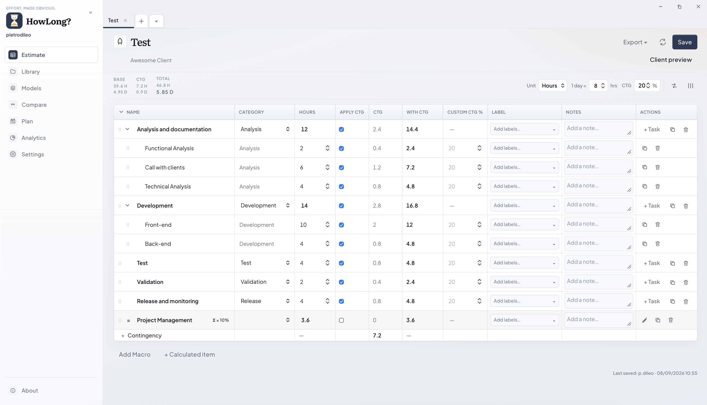
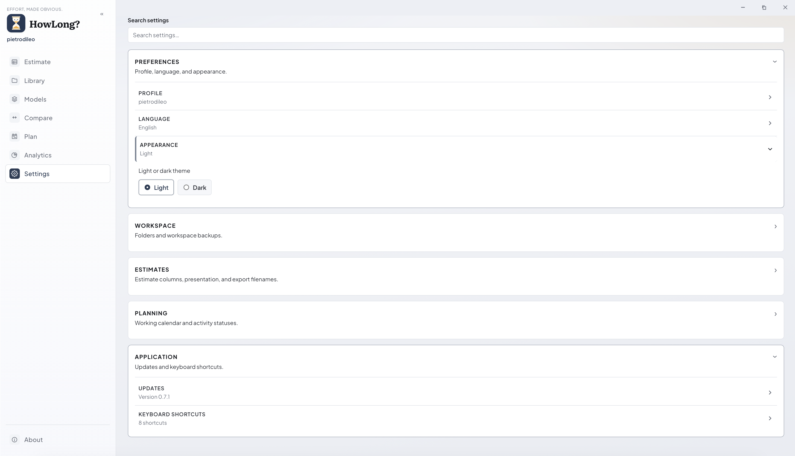
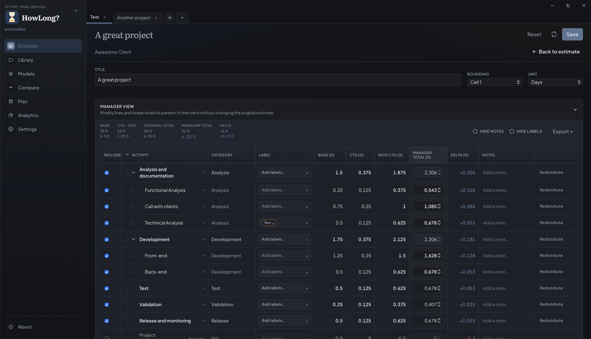
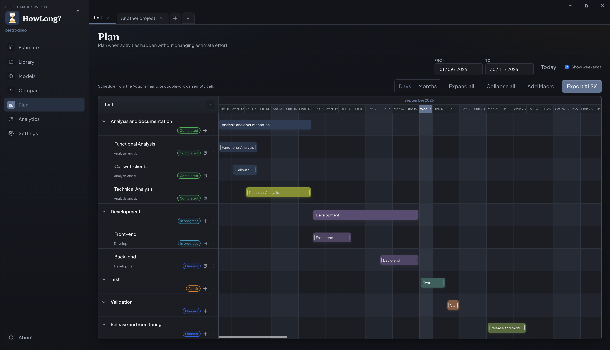

<p align="center">
  
</p>

<p align="center">
  <strong>HowLong?</strong>
</p>

<p align="center">
  How often does someone ask, <strong><i>"How long will this take?"</i></strong>
</p>

<p align="center">
  <a href="https://github.com/pietrodileo/howlong/releases"></a>
  <a href="LICENSE"></a>
  <a href="https://v2.tauri.app"></a>
  <a href="https://github.com/pietrodileo/howlong/releases"></a>
</p>

*HowLong?* is a desktop app for building, planning, analyzing, comparing, and delivering project estimates. It keeps estimates clear and structured, with data stored locally in readable JSON files. There is no account or cloud service, so your estimates stay private and under your control.

<p align="center">
  <a href="#what-it-does">What it does</a> ·
  <a href="#features">Features</a> ·
  <a href="docs/WHATS_NEW.md">What's new</a> ·
  <a href="#export-outputs">Exports</a> ·
  <a href="#app-showcase">Screens</a> ·
  <a href="#download">Download</a> ·
  <a href="#build-from-source">Build from source</a> ·
  <a href="docs/guides/GUIDE.en.md">🇬🇧 English guide</a> ·
  <a href="docs/guides/GUIDE.it.md">🇮🇹 Guida italiana</a>
</p>

---

# What it does

Spreadsheets can make estimates difficult to reuse, audit, or hand off. *HowLong?* keeps effort, contingency, and structure together in one editable document, with separate views for **internal planning** and **client delivery**.

Settings, models, and estimates stay on disk as readable JSON files. They remain portable and under your control. No account or cloud service is required.

# Features

## Estimates

- Use a bundled Italian or English model, or create a reusable template of your own.
- Break work into macros, subtasks, categories, labels, and notes.
- Add formula rows for sums, averages, minimums, maximums, and percentage-based overhead or management effort.
- Set contingency globally, by category, or for individual rows. Compare scenarios A/B/C before you commit.
- Keep project metadata and an audit history of saves.

## Planning and analysis

- **Plan:** Build a day- or month-based Gantt, choose whether weekends count, save scheduling edits directly from Plan, and export a complete view of each activity with its effort, contingency, and planned timeline.
- **Analytics:** Get an overview of the estimate with summary cards, a donut chart, and stacked bars. Drill into one macro or expand several.
- **Compare:** Review saved estimates side by side, including each estimate's formula details, applied CTG, and total with contingency.
- **Manager view:** Adjust the presentation by rounding or redistributing values, including or excluding rows, and overriding totals.
- **Client view:** Show a filtered version of the estimate with only what you plan to deliver.

## Files and workflow

- Save estimates in the local **Library**, either in the default app-data folder or in a folder you choose.
- Import and export JSON, YAML, and XLSX. Export a selection of Library files as a ZIP.
- Open exported files from the completion dialog.
- Use keyboard shortcuts for saving, tabs, views, and undo/redo.
- Search settings by name, expand only the group you need, and let changes save automatically.
- Choose English or Italian, and switch between light and dark themes across the app.

# Download

Download the latest stable installer from the [GitHub Releases page](https://github.com/pietrodileo/howlong/releases). If the desktop app is already installed, use **Settings → Updates** to download and install the appropriate update for your system.

> **Already have HowLong installed?** Reinstalling updates the application files but keeps your estimates, Library, and settings. If the existing copy was installed in a different location, you may end up with two copies. For a normal update, use **Settings → Updates** instead.

## Install

### macOS

Download the `.dmg` installer from the [GitHub Releases page](https://github.com/pietrodileo/howlong/releases), or use the bootstrapper to install the latest stable release:

```bash
curl -fsSL https://raw.githubusercontent.com/pietrodileo/howlong/main/scripts/install/unix.sh | bash
```

The bootstrapper installs the matching macOS `.dmg` for the current user. Check the remote script before piping it to a shell. To make the install reproducible, replace `main` with a reviewed commit or tag.

### Windows

Download the `.exe` or `.msi` installer from the [GitHub Releases page](https://github.com/pietrodileo/howlong/releases), or use PowerShell to install the Windows x64 `.exe`:

```powershell
irm https://raw.githubusercontent.com/pietrodileo/howlong/main/scripts/install/windows.ps1 | iex
```

Check the remote script before piping it to PowerShell. To make the install reproducible, replace `main` with a reviewed commit or tag.

### Linux

Download the `.AppImage` or another published package from the [GitHub Releases page](https://github.com/pietrodileo/howlong/releases), or use the bootstrapper to install the matching Linux x64 or ARM64 AppImage:

```bash
curl -fsSL https://raw.githubusercontent.com/pietrodileo/howlong/main/scripts/install/unix.sh | bash
```

Check the remote script before piping it to a shell. To make the install reproducible, replace `main` with a reviewed commit or tag.

The bootstrapper installs stable releases only. For an existing installation, use **Settings → Updates**.

See [What's new](docs/WHATS_NEW.md) for the feature history of each stable release.

## Uninstall

To remove *HowLong?* without deleting your estimates:

- **Windows:** Open **Settings → Apps → Installed apps**, select **HowLong**, and choose **Uninstall**. You can open the settings page from PowerShell with:

  ```powershell
  Start-Process "ms-settings:appsfeatures"
  ```

- **macOS:** The bootstrapper installs the app for the current user at `~/Applications/HowLong.app`. Remove it with:

  ```bash
  rm -rf "$HOME/Applications/HowLong.app"
  ```

  If you installed the app manually in `/Applications`, remove `/Applications/HowLong.app` instead.

- **Linux:** The bootstrapper installs the AppImage at `~/.local/bin/howlong`. Remove it with:

  ```bash
  rm -f "$HOME/.local/bin/howlong"
  ```

These commands remove only the application. Your workspace, estimates, and settings stay on disk. Delete them separately if you want to reset all application data.

# Export outputs

*HowLong?* lets you export the complete estimate or a focused view for internal review, client delivery, or timeline communication. Choose the source view based on who will use the file and what they need to see.

| Source   | What it contains                                                   | Best for               |
| -------- | ------------------------------------------------------------------ | ---------------------- |
| Estimate | Full estimate with hierarchy, formulas, contingency, and notes    | Technical handover     |
| Manager  | Rounded or redistributed values                                   | Internal approval      |
| Client   | Included activities with visible notes and labels                 | Client delivery        |
| Plan     | Gantt timeline with dates, status, owners, effort, and planned work | Timeline communication |

| Format         | Use it for                                                             |
| -------------- | ---------------------------------------------------------------------- |
| `.howlong.json` | Native editable estimate, and the only format you can re-import       |
| YAML           | Structured data for reviewed AI workflows, such as drafting Jira tickets |
| XLSX           | Readable snapshot of any source view                                  |
| ZIP            | An archive containing multiple Library exports                        |

Exports are copies of the current estimate or view. They do not replace **Save**, which updates the working file in the Library. `.howlong.json` is the only format you can import back into HowLong; YAML and XLSX are for reading, sharing, or downstream workflows, while ZIP bundles multiple exports.

# App showcase

Start on the Home screen to create or open an estimate, browse the Library, or reopen a recent file. Once an estimate is open, the editor gives you access to Plan and Analytics.


The Estimate view keeps the base, contingency, and total figures visible above a hierarchical activity table. Use the unit, hours-per-day, contingency, column, export, reload, and save controls from the header.



The editor also supports multiple estimates in tabs. From an open tab, switch to Plan for the Gantt timeline or Analytics for a visual summary, shown below.


Settings are grouped into searchable panels. Choose a light or dark theme, configure the workspace and estimate defaults, and access updates and keyboard shortcuts without leaving the app.



| Dark theme manager view | Dark theme plan view |
| ----------------------- | -------------------- |
|  |  |

| Planning                                                   | Analytics                                                                    |
| ---------------------------------------------------------- | ---------------------------------------------------------------------------- |
|  |  |

For a walkthrough of settings, shortcuts, formats, and troubleshooting, see the [English manual](docs/guides/GUIDE.en.md) or [manuale italiano](docs/guides/GUIDE.it.md).

# Technology Stack

*HowLong?* is built using a modern, open source desktop architecture. Each layer leverages proven tools and libraries to ensure performance, reliability, and maintainability:

| Layer                | Technology                       | Purpose                                           |
| -------------------- | ------------------------------- | ------------------------------------------------- |
| Desktop shell        | Tauri 2, Rust                    | Secure, lightweight native integration            |
| Interface            | Vue 3, TypeScript, Vite          | Reactive UI, strong typing, and rapid development |
| State & validation   | Pinia, Zod                       | Centralized state management and schema validation |
| Spreadsheet export   | ExcelJS                          | Exports to Excel/XLSX files                       |
| Persistent storage   | Local JSON files                  | Fast, transparent local persistence                |

*HowLong?* takes advantage of your operating system's built-in webview—meaning there's no need to bundle Chromium or any separate browser engine. This results in smaller installers, better performance, and seamless integration with Windows, macOS, and Linux.

# Build from source

For detailed instructions on prerequisites, local development, testing, building for release, signing, tagging, and configuring the updater, refer to the [Build and Release Guide](docs/BUILD.md).

# Repository layout

Contributor rules are in [AGENTS.md](AGENTS.md).

```text
.
├── src/
│   ├── app/            Shell, navigation, i18n, global UI
│   ├── domain/         Shared calculations
│   ├── features/       Estimate, plan, analytics, compare, models, library, settings
│   ├── models/         Schemas and domain types
│   ├── platform/       Tauri and file I/O
│   └── shared/         Reusable UI and helpers
├── src-tauri/          Rust app and Tauri config
├── scripts/            Build, install, and smoke tests
├── docs/WHATS_NEW.md   Stable-release feature history
├── docs/guides/        User guides
├── docs/images/        Guide screenshots
└── package.json
```

# Data and privacy

By default, HowLong? stores data in the Tauri app-data directory for `com.pietrodileo.howlong`. You can choose another folder for the Library in Settings.

You can use a synced folder with OneDrive, Google Drive, or Dropbox to share models and estimates with colleagues. Everyone needs the sync client and access to the same shared folder. **Do not edit the same** `.howlong.json` **at the same time** because the app does not provide file locking or conflict merging.

Estimate files use the `.howlong.json` suffix.

# License

MIT. See the [LICENSE](LICENSE).
