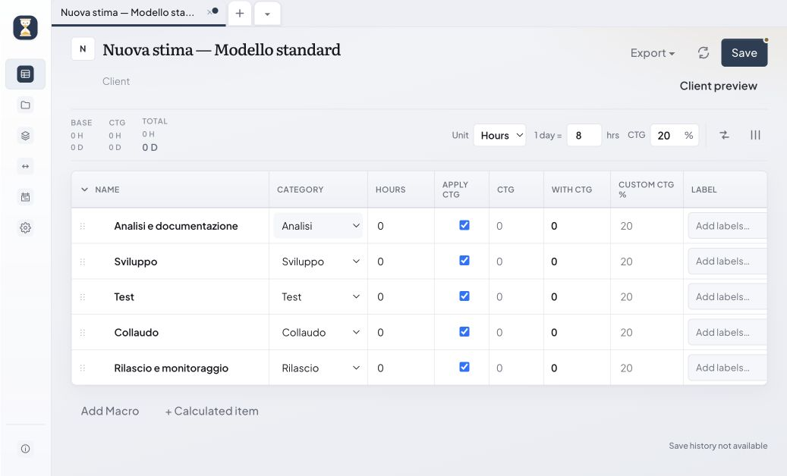
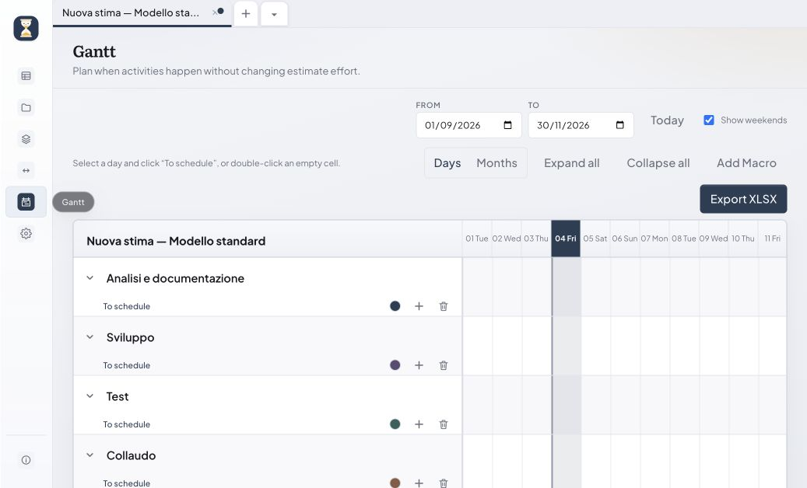

# HowLong?

> Effort, made obvious.

HowLong? is a local-first desktop application for creating, comparing, and sharing project estimates without relying on spreadsheets. It combines reusable estimate models, contingency calculations, manager and client views, and multi-format exports in a lightweight native app.

**Current version:** `0.5.1`

User guides: [English](GUIDE.en.md) · [Italiano](GUIDE.it.md)

## Why HowLong?

Project estimates often begin in spreadsheets and become difficult to reuse, audit, and present. HowLong? keeps the calculation model structured while providing separate views for internal planning and client communication.

All project data remains in local JSON files. No account, hosted service, or database is required.

## Features

- Build estimates from reusable models and hierarchical work items.
- Plan estimate activities on an adaptive day- or month-based Gantt timeline with configurable weekend days.
- Apply contingency globally, by category, or by individual item.
- Add derived formula rows for overhead, management, and related effort.
- Maintain notes, tags, project metadata, and an audit history.
- Compare multiple estimates and contingency scenarios.
- Present separate manager and client views.
- Store estimates in a configurable local library.
- Import and export JSON, YAML, XLSX, and CSV; export library selections as ZIP archives and open generated files from the completion message.
- Use keyboard shortcuts to save, create and close tabs, change views, and move between open estimate tabs.
- Use the interface in English or Italian with light and dark themes.

## Screenshots

### Estimate editor



### Gantt planning



## Technology

| Layer | Technology |
| --- | --- |
| Desktop shell | Tauri 2 and Rust |
| Interface | Vue 3, TypeScript, and Vite |
| State | Pinia |
| Validation | Zod |
| Spreadsheet export | ExcelJS |
| Storage | Local JSON files |

HowLong? uses the operating system's native webview through Tauri rather than bundling a browser runtime.

## Requirements

All platforms require:

- [Node.js](https://nodejs.org/) 20 or later
- [Rust](https://www.rust-lang.org/tools/install) stable
- Platform-specific [Tauri 2 prerequisites](https://v2.tauri.app/start/prerequisites/)

Additional platform requirements:

| Platform | Requirements |
| --- | --- |
| Windows | Visual Studio Build Tools 2022 with C++ tools, Windows SDK, and WebView2 |
| macOS | Xcode Command Line Tools |
| Linux | WebKitGTK and the distribution packages required by Tauri |

## Development

Install dependencies:

```bash
npm install
```

Run the complete desktop application:

```bash
npm run tauri:dev
```

Run only the browser-based frontend:

```bash
npm run dev
```

The browser mode is useful for interface work, but native filesystem and dialog features require Tauri.

## Testing

```bash
npm run build
npm run smoke
npm run smoke:gantt
```

`npm run build` type-checks and bundles the frontend. The smoke commands check contingency and Gantt date calculations.

## Release builds

Build scripts run from any working directory and place native artifacts under `src-tauri/target/release/bundle/`.

### Windows

```bat
scripts\build-windows.bat
```

### macOS

```bash
./scripts/build-macos.sh
```

Typical outputs are `.app` and `.dmg` bundles.

### Linux

```bash
./scripts/build-linux.sh
```

Available bundle formats depend on the installed Linux packaging tools and Tauri configuration.

To build manually on any supported platform:

```bash
npm run tauri build
```

Tauri builds are platform-native: build Windows installers on Windows, macOS bundles on macOS, and Linux packages on Linux.

## Versioning

HowLong? follows semantic versioning in the form `x.y.z`:

| Part | Name | Increment when |
| --- | --- | --- |
| `x` | Major | A release introduces incompatible or fundamental product changes |
| `y` | Minor | A release adds backward-compatible functionality |
| `z` | Patch | A release contains backward-compatible fixes or small improvements |

Examples:

- `0.5.1` → `0.5.2` for a bug fix
- `0.5.1` → `0.6.0` for a new feature
- `0.5.1` → `1.0.0` for the first stable major release

Keep the version synchronized in:

- `package.json` and `package-lock.json`
- `src-tauri/Cargo.toml` and `src-tauri/Cargo.lock`
- `src-tauri/tauri.conf.json`
- `src/App.vue`, which displays the version in the About dialog

## Repository layout

```text
.
├── src/
│   ├── components/     Reusable Vue components
│   ├── i18n/           English and Italian messages
│   ├── lib/            Calculation, import, export, and I/O logic
│   ├── models/         Domain schemas and types
│   ├── stores/         Pinia application state
│   └── views/          Main application screens
├── src-tauri/          Rust application and Tauri configuration
├── scripts/            Development, build, and smoke-test scripts
├── GUIDE.en.md         English user guide
├── GUIDE.it.md         Italian user guide
└── package.json
```

## Data and privacy

Settings, models, and estimates are stored locally. The default location is the Tauri application data directory for `com.pietrodileo.howlong`; the estimate library can be moved to a custom folder from Settings.

Estimate files use the `.howlong.json` suffix and remain human-readable and portable.

## License

HowLong? is distributed under the terms in [LICENSE](LICENSE).
