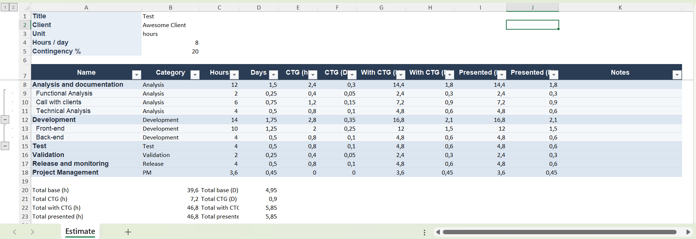
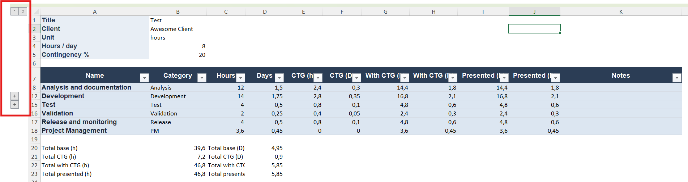
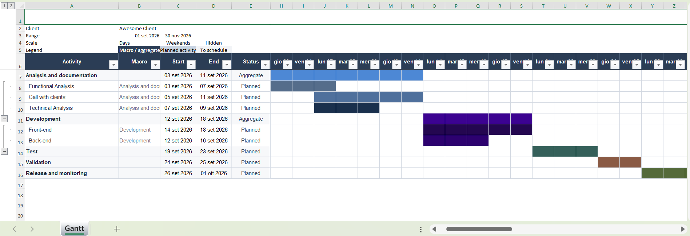

# Manuale utente di HowLong?

HowLong? `0.6.1` su Windows, macOS e Linux.

[README del progetto](../../README.md) · [Manuale italiano](GUIDE.it.md)

**Prima sessione:** [Avvio rapido](#1-avvio-rapido) → [Impostazioni](#3-impostazioni) → crea una stima → **Salva**.

---

## Indice

- [1. Avvio rapido](#1-avvio-rapido)
- [2. Area di lavoro e navigazione](#2-area-di-lavoro-home-e-navigazione-nella-barra-laterale)
  - [2.1. Barra laterale](#21-navigazione-nella-barra-laterale)
  - [2.2. Azioni Home](#22-vista-home-panoramica-dellarea-di-lavoro)
    - [2.2.1. Termini chiave](#termini-chiave-nella-tua-area-di-lavoro)
- [3. Impostazioni](#3-impostazioni)
  - [3.1. Cartelle sincronizzate](#31-cartelle-sincronizzate)
- [4. Modelli](#4-modelli)
- [5. Editor delle stime](#5-editor-delle-stime)
  - [5.1. La tua prima stima](#la-tua-prima-stima)
  - [5.2. Schede e stato](#schede-e-stato)
  - [5.3. Intestazione e totali](#intestazione-e-totali)
  - [5.4. Tabella delle attività](#tabella-delle-attività)
  - [5.5. Elementi calcolati](#elementi-calcolati)
  - [5.6. Confronto della contingenza](#confronto-della-contingenza)
- [6. Presentazione per manager e cliente](#6-presentazione-per-manager-e-cliente)
  - [6.1. Accesso alle modalità di presentazione](#accesso-alle-modalità-di-presentazione)
  - [6.2. Vista Manager](#vista-manager)
  - [6.3. Vista Cliente](#vista-cliente)
- [7. Salvataggio, apertura, ricaricamento e file recenti](#7-salvataggio-apertura-ricaricamento-e-file-recenti)
- [8. Libreria](#8-libreria)
- [9. Confrontare le stime](#9-confrontare-le-stime)
- [10. Pianificare con il Gantt](#10-pianificare-con-il-gantt)
- [11. Analisi](#11-analisi)
  - [11.1. Panoramica](#panoramica)
  - [11.2. Mostra attività (più macro)](#mostra-attività-in-più-macro)
  - [11.3. Focus (una macro)](#focus-singola-macro)
- [12. Importazione, esportazione e backup](#12-importazione-esportazione-e-backup)
  - [12.1. Scegliere la vista sorgente](#scegliere-la-vista-sorgente-per-lesportazione)
- [13. Scorciatoie da tastiera](#13-scorciatoie-da-tastiera)
- [14. Cosa mostrano o non modificano alcune schermate](#14-cosa-mostrano-alcune-schermate--e-cosa-non-fanno)
- [15. Risoluzione dei problemi e sicurezza](#15-risoluzione-dei-problemi-e-pratiche-sicure)

---

## 1. Avvio rapido

1. **Impostazioni** — Imposta lingua, tema, nome utente e area di lavoro preferiti, quindi fai clic su **Salva**.
2. **Stima** — Fai clic su **Nuova stima** (viene usato il modello predefinito, a meno che tu non ne selezioni uno diverso usando il menu a freccia).
3. Inserisci un nome per la stima e il cliente, quindi compila le ore stimate per ciascuna attività.
4. Fai clic su **Salva** — il file apparirà ora nella **Libreria**.
5. Controlla le sezioni **Piano**, **Analisi** e **Anteprima cliente** per verificare il lavoro.

| Azione            | Risultato                                                  |
| ----------------- | ---------------------------------------------------------- |
| **Salva**   | Aggiorna il file di lavoro`.howlong.json` nella Libreria |
| **Esporta** | Crea un file di consegna separato; non salva la stima      |

## 2. Area di lavoro, Home e navigazione nella barra laterale

Quando avvii *HowLong?* o chiudi tutte le stime, appare la vista **Home**, che mostra le azioni principali e una panoramica della navigazione.

---

### 2.1. Navigazione nella barra laterale

La **barra laterale** è il pannello di navigazione centrale: usala per passare immediatamente tra le principali aree dell'app. Ogni icona della barra laterale porta a una funzionalità che supporta il flusso di lavoro di stima o la gestione dell'area di lavoro.

| Vista barra laterale   | Scopo                                                                                  |
| ---------------------- | -------------------------------------------------------------------------------------- |
| **Stima**        | Crea e modifica le stime di progetto, inserendo impegno e dettagli                     |
| **Libreria**     | Accede e gestisce i file di stima salvati                                              |
| **Modelli**      | Definisce e modifica modelli riutilizzabili con categorie, etichette e impostazioni    |
| **Confronta**    | Confronta visivamente le stime affiancate                                              |
| **Piano**        | Visualizza la timeline del progetto (diagramma di Gantt) usando i dati della stima     |
| **Analisi**      | Analizza suddivisioni, panoramiche e dettagli della stima attiva                       |
| **Impostazioni** | Personalizza lingua, aspetto, valori predefiniti, area di lavoro e informazioni utente |
| **Informazioni** | Legge dettagli sull'app, sulla versione e sui riconoscimenti                           |

Tieni presente che:

- **Piano** e **Analisi** seguono sempre la scheda attualmente attiva. Se non è aperta alcuna stima, queste viste chiedono di crearne o caricarne una.
- Puoi comprimere la barra laterale con la doppia freccia accanto al logo. In modalità compatta, passa il mouse su un'icona per visualizzarne l'etichetta.

---

### 2.2. Vista Home (panoramica dell'area di lavoro)

Quando non è aperta alcuna stima, la schermata **Home** ti aiuta a iniziare, riprendere un lavoro recente o esplorare l'area di lavoro. Riunisce le attività più usate per un accesso rapido.

**Azioni Home:**

- **Nuova stima** — usa il modello predefinito; usa la freccia per sceglierne uno diverso
- **Apri file** — carica qualsiasi `.howlong.json` dal sistema
- **Vai alla Libreria** — apre la cartella delle stime dell'area di lavoro
- **Aperti di recente** — fino a cinque delle stime salvate più recenti

---

#### Termini chiave nella tua area di lavoro

| Termine                     | Significato                                                                                 |
| --------------------------- | ------------------------------------------------------------------------------------------- |
| **Modello**           | Struttura riutilizzabile: memorizza valori predefiniti, categorie, etichette, formule e CTG |
| **Stima**             | Documento di progetto basato su un modello o creato da zero                                 |
| **Macro**             | Attività di primo livello in una stima; può contenere sottoattività                      |
| **Sottoattività**    | Attività all'interno di una macro; il suo impegno contribuisce al totale della macro       |
| **Formula**           | Riga calcolata usando attività selezionate                                                 |
| **Contingenza / CTG** | Margine di rischio applicato al lavoro idoneo                                               |
| **Sessione**          | Copia in memoria aperta in una scheda finché non salvi                                     |
| **Libreria**          | Cartella locale contenente tutti i file di stima`.howlong.json`                           |

## 3. Impostazioni

La sezione **Impostazioni** ti consente di adattare HowLong? al tuo flusso di lavoro personale, agli standard del team e all'organizzazione dell'area di lavoro. Configura dettagli utente, lingua dell'interfaccia, aspetto, posizione dell'area di lavoro, valori predefiniti delle stime, formati di esportazione e altro ancora. Usa Impostazioni prima di iniziare la tua prima stima per assicurarti che l'ambiente corrisponda alle tue esigenze, e torna in questa sezione ogni volta che i requisiti cambiano.

Apri **Impostazioni** prima della tua prima stima.

Ogni intestazione espande i relativi controlli. Le sezioni chiuse mantengono comunque le impostazioni. **Salva** dopo le modifiche: la sola anteprima non le rende persistenti.

**Profilo e visualizzazione**

- **Profilo** — nome utente registrato al salvataggio (per impostazione predefinita, il nome utente del sistema operativo)
- **Lingua** — interfaccia in inglese o italiano
- **Aspetto** — tema chiaro o scuro
- **Scorciatoie da tastiera** — combinazioni attive; elenco completo nella [Sezione 13](#13-scorciatoie-da-tastiera)

**Valori predefiniti della stima**

- **Gantt** — giorni del fine settimana; nascondere i fine settimana influisce solo sulla visualizzazione, non sulle date salvate
- **Vista stima** — valori predefiniti dell'editor, incluse le colonne compatte
- **Presentazione** — stabilisce se note ed etichette per manager/cliente iniziano nascoste
- **Nome file di esportazione** — data/ora opzionali nei nomi file generati

**Area di lavoro**

- **Area di lavoro** — percorsi di stime e modelli; **Scegli cartella…** o **Usa predefinita** (l'area di lavoro predefinita è una cartella `HowLong` all'interno della directory "Documents" del sistema).Tutte le stime, i modelli e i dati correlati vengono sincronizzati con la cartella dell'area di lavoro selezionata. Se cambi la posizione dell'area di lavoro, l'app mostrerà i dati presenti nella cartella corrente; tornando a un'area di lavoro precedente ritroverai i dati come li avevi lasciati. Cambiare area di lavoro non comporta perdita di dati; ogni area di lavoro conserva i propri dati.
- **Importazione/esportazione area di lavoro** — solo impostazioni e modelli (le stime restano nella Libreria)

### 3.1. Cartelle sincronizzate

Puoi impostare la cartella dell'Area di lavoro su una posizione mantenuta sincronizzata da un servizio cloud come OneDrive, Google Drive, Dropbox o uno strumento simile. Questo consente a te e ai tuoi colleghi di condividere automaticamente modelli e stime semplicemente lavorando in una cartella condivisa.

**Come funziona:**

- Chiunque necessiti di accesso deve avere installato il software di sincronizzazione appropriato (ad es. OneDrive, Google Drive, Dropbox) e disporre dell'autorizzazione ad accedere alla cartella condivisa.
- Quando salvi o aggiorni file `.howlong.json`, i colleghi vedranno le modifiche non appena il loro client di sincronizzazione si aggiorna.

**Suggerimenti importanti per l'uso:**

- *Attendi il completamento della sincronizzazione* prima di aprire un file che qualcun altro ha appena modificato. Ad esempio, se qualcuno salva una stima, gli altri dovrebbero lasciare che il proprio client di sincronizzazione completi l'aggiornamento prima di aprire lo stesso file.
- **Non aprire e modificare mai contemporaneamente lo stesso file di stima su computer diversi.** Non esiste alcun supporto per il blocco o l'unione automatica: se due persone salvano modifiche nello stesso file, possono sovrascrivere accidentalmente il lavoro reciproco e perdere dati.

**Esempi:**

- *Esempio 1:* Il tuo team usa Google Drive per conservare tutti i file di stima `.howlong.json` in una cartella condivisa. Prima che qualcuno apra un file `.howlong.json`, è necessario verificare che Google Drive abbia terminato la sincronizzazione.
- *Esempio 2:* Una collega modifica una stima in una cartella sincronizzata con Dropbox. Lascia che Dropbox termini la sincronizzazione prima di comunicare a qualcun altro che può aprirla sul proprio portatile. Evitano di aprirla contemporaneamente per prevenire conflitti.

## 4. Modelli

La sezione **Modelli** consente di definire, modificare e gestire strutture di progetto riutilizzabili per le tue stime. I modelli fanno risparmiare tempo e garantiscono coerenza registrando attività standard del team, categorie, macro, sottoattività, contingenze e formule di impegno, così da non dover ripartire da zero per ogni nuova stima. Usa questa sezione per creare modelli adatti ai tuoi progetti tipici, rendendo semplice creare nuove stime accurate con logica predefinita. I modelli sono particolarmente utili per i team con tipi di progetto ricorrenti, categorie standard o per chi vuole applicare buone pratiche nel proprio flusso di pianificazione.

Sono inclusi modelli in italiano e in inglese. Apri **Modelli** per modificare o creare strutture riutilizzabili.

Il pannello sinistro mostra l'elenco dei modelli (con quello predefinito indicato); il pannello destro mostra l'editor.

1. Fai clic su **Nuovo** o importa un modello compatibile.
2. Specifica nome, icona, ID stabile e ore per giornata lavorativa del modello.
3. Aggiungi le categorie necessarie.
4. Imposta il CTG predefinito (espandi **Come funziona** per maggiori informazioni).
5. Aggiungi macro, sottoattività, valori di impegno predefiniti, flag CTG, etichette e formule.

Trascina e rilascia gli elementi per riordinarli. Usa la freccia per espandere e mostrare i figli. Fai clic su **+ Attività** per aggiungere una sottoattività. Ogni riga offre opzioni per duplicare o eliminare (cestino) l'elemento. Usa **Salva**, **Elimina** o **Esporta** per gestire il modello.

Il modello predefinito viene usato quando selezioni **Nuova stima** o premi `Ctrl/Cmd+T`. Tieni presente che le stime salvate sono istantanee: non si aggiornano se cambia il modello di origine.

## 5. Editor delle stime

L'**Editor delle stime** è il luogo in cui crei, visualizzi e modifichi stime di progetto dettagliate. Usa questa sezione per suddividere il lavoro in attività, applicare contingenze, organizzare le attività gerarchicamente e calcolare sia l'impegno di base sia quello rettificato. L'editor è progettato per aiutarti a pianificare con precisione tempi e costi di progetto, dandoti al contempo il pieno controllo sulla struttura delle attività e sulle stime. Offre supporto multi-scheda per lavorare contemporaneamente su più stime o sessioni, modifica e riordino intuitivi e potenti strumenti per aggregare e confrontare l'impegno. Che tu stia creando nuove stime da zero, rivedendo quelle salvate o collaborando con il team, l'Editor delle stime offre tutte le funzionalità necessarie per una pianificazione di progetto precisa e flessibile.

### La tua prima stima

Per creare la tua prima stima:

- **Dalla Home:** fai clic su **Nuova stima** per iniziare con il modello predefinito, oppure seleziona un modello diverso dall'elenco.
- **Da un documento aperto:** usa il pulsante **+** nella barra delle schede per aprire una nuova stima (modello predefinito), oppure scegli un modello dall'elenco.

### Schede e stato

| Segnale               | Significato                                      |
| --------------------- | ------------------------------------------------ |
| Sottolineatura scura  | Scheda attiva                                    |
| Punto di modifica     | Modifiche non salvate                            |
| Chiudi scheda         | Chiede conferma se ci sono modifiche non salvate |
| Riapri lo stesso file | Passa alla scheda esistente (nessun duplicato)   |

Ogni scheda ha il proprio annulla/ripristina: `Ctrl/Cmd+Z`; ripristina è `Ctrl+Y` (Windows/Linux) oppure `Cmd+Shift+Z` (macOS).

### Intestazione e totali

In alto puoi modificare **titolo**, **cliente** e **icona** della stima. I valori di impegno **Base**, **CTG** (contingenza) e **Totale** vengono visualizzati sia in ore sia in giorni.

La barra degli strumenti offre accesso rapido a: selezione unità · ore al giorno · contingenza globale (CTG) · confronto contingenza · visibilità colonne · esportazione · ricaricamento · salvataggio · anteprima cliente.

La modifica delle **ore al giorno** cambia solo il modo in cui vengono visualizzati i giorni-persona: l'impegno sottostante viene sempre memorizzato in ore.

### Tabella delle attività

| Colonna              | Descrizione                                                                     |
| -------------------- | ------------------------------------------------------------------------------- |
| Nome                 | Titolo dell'attività — macro, sottoattività o formula, mostrato in gerarchia |
| Categoria            | Categoria/gruppo; può essere destinata alla contingenza (CTG)                  |
| Ore / Giorni         | Impegno di base stimato, prima della contingenza (CTG)                          |
| Applica CTG          | Indica se questa riga riceve una contingenza aggiuntiva                         |
| CTG                  | Importo di contingenza calcolato                                                |
| Con CTG              | Impegno totale con contingenza inclusa (base + CTG)                             |
| CTG personalizzato % | Override della percentuale di contingenza specifico della riga                  |
| Etichetta            | Tag personalizzati per filtrare o raggruppare                                   |
| Note                 | Note interne; non mostrate al cliente per impostazione predefinita              |
| Azioni               | Aggiunge sottoattività, modifica formula, duplica o elimina questa riga        |

**Modifica**

- Fai clic su una cella per modificarla
- Aggiungi macro o formule con i pulsanti sotto la tabella
- Le sottoattività vengono sommate nella macro; il CTG su una macro si applica ai suoi figli
- Trascina la maniglia per riordinare le righe

**Note e colonne**

- Doppio clic su una nota → editor esteso (`Ctrl+Enter` per salvare)
- Doppio clic sull'intestazione di una colonna → comprimi o espandi quella colonna

### Elementi calcolati

Le righe contrassegnate come "elementi calcolati" usano formule per calcolare automaticamente i valori in base ad altre attività della stima. Invece di inserire manualmente l'impegno, queste righe aggregano o trasformano i dati di macro o sottoattività selezionate, ad esempio sommandoli, calcolandone la media o applicando un calcolo personalizzato. Gli elementi calcolati si aggiornano in tempo reale quando cambiano le attività a cui fanno riferimento, garantendo che totali e valori derivati restino sempre accurati e coerenti in tutta la stima.

Una formula è `aggregazione(righe selezionate) × percentuale`.

| Aggregazione | Opzioni                                                               |
| ------------ | --------------------------------------------------------------------- |
| Matematica   | Somma · media · min · max                                          |
| CTG          | Si applica solo quando**Applica CTG** è attivo per quella riga |

### Confronto della contingenza

Il confronto della contingenza consente di esplorare come diverse percentuali di contingenza influenzano la stima senza modificare l'impegno di base. Modellando più scenari ipotetici affiancati, puoi comunicare il rischio, mostrare l'effetto delle scelte di margine e aiutare gli stakeholder a prendere decisioni informate sul livello di contingenza più adatto alle esigenze del progetto.

Confronta gli scenari **A**, **B** e **C** mentre **l'impegno di base resta fisso**.

1. Imposta le percentuali nel pannello
2. **Usa** — applica uno scenario alla sessione corrente
3. **Salva** — mantiene la scelta; **Chiudi** — nasconde il pannello

## 6. Presentazione per manager e cliente

Esistono tre modalità principali di presentazione: **Stimatore**, **Manager** e **Cliente**. Ogni modalità è progettata per un pubblico diverso e offre livelli differenti di dettaglio e controllo sulle informazioni visualizzate o modificabili.

| Funzionalità / Vista             | Vista Stimatore                                               | Vista Manager                                                          | Vista Cliente                                              |
| --------------------------------- | ------------------------------------------------------------- | ---------------------------------------------------------------------- | ---------------------------------------------------------- |
| **Pubblico**                | Stimatore interno (tu)                                        | Manager che preparano la condivisione con i clienti                    | Clienti finali                                             |
| **Accesso**                 | Schermata di modifica principale                              | Tramite Anteprima cliente > scheda Manager                             | Tramite Anteprima cliente > scheda Cliente                 |
| **Modificabile**            | Completo: aggiunta/modifica di attività, formule e struttura | Può regolare totali visualizzati, visibilità e note                  | Nessuna modifica: sola lettura, semplificata per chiarezza |
| **Colonne**                 | Tutte le colonne visibili e modificabili                      | Può personalizzare la visibilità delle colonne nell'esportazione     | Solo colonne/campi selezionati per chiarezza               |
| **Note ed etichette**       | Completamente modificabili                                    | Può mostrarle/nasconderle per l'esportazione                          | Visualizzate solo se consentite dal manager                |
| **Contingenza e CTG**       | Modificabili e visibili nel calcolo                           | Mostrati, possono essere presentati come totali arrotondati/rinominati | Mostrati come numeri arrotondati e adatti al cliente       |
| **Logica di presentazione** | I calcoli principali non sono influenzati dalle modifiche qui | Le modifiche di presentazione non influenzano la logica di base        | Segue le impostazioni del manager, non può sostituirle    |
| **Esportazione**            | Tipicamente per revisione interna                             | Crea un file pronto per il cliente con le rettifiche del manager       | Output finale destinato al cliente                         |
| **Confronta differenze**    | Non mostrato                                                  | Può visualizzare/modificare in anteprima le differenze nei totali     | Presentate solo come definito dal manager                  |

Queste modalità di presentazione consentono di adattare il modo in cui la stima viene consegnata per revisioni interne o esterne senza alterare i calcoli o i dati principali.
Ogni vista garantisce che venga mostrato il giusto livello di dettaglio al pubblico previsto, proteggendo le informazioni sensibili quando necessario.

### Accesso alle modalità di presentazione

Per aprire queste viste, usa il pulsante **Anteprima cliente** nell'intestazione della stima. Si apre una pagina affiancata che mostra sia il layout manager sia quello cliente, così puoi confrontare facilmente ciò che vedrà ciascuno.

---

### Vista Manager

La vista Manager è progettata per uso interno e consente di finalizzare e regolare la stima prima di condividerla con il cliente.

Puoi:

- Rifinire i totali e regolare il modo in cui vengono mostrati i numeri.
- Aggiungere, nascondere o annotare informazioni che devono — o non devono — comparire nell'esportazione per il cliente.
- Identificare visivamente le differenze tra i totali calcolati e quelli che verranno presentati.

| Controllo                              | Cosa fa                                                                                     |
| -------------------------------------- | ------------------------------------------------------------------------------------------- |
| Titolo cliente, arrotondamento, unità | Imposta come vengono etichettati e formattati i totali nell'esportazione                    |
| Totale presentato                      | Modifica il valore mostrato; visualizza la differenza rispetto alla base calcolata o al CTG |
| Includi / escludi                      | Sceglie quali righe compaiono nell'output per il cliente                                    |
| Etichette e note                       | Regola il contenuto che verrà passato a valle                                              |
| **Ridistribuisci**               | Ripartisce uniformemente un totale macro modificato tra le relative attività figlie        |

Tutte le regolazioni qui sono **solo per la presentazione**: non alterano la logica di calcolo. Esporta da questa vista per generare un file modificato dal manager per la consegna al cliente.

---

### Vista Cliente

La vista Cliente mostra una versione semplificata della stima, che riflette solo le informazioni e il layout destinati al cliente. Applica automaticamente i filtri e le eventuali modifiche del manager.

Visualizza in anteprima ciò che riceve il cliente.

| Controllo                | Effetto                               |
| ------------------------ | ------------------------------------- |
| **Sottoattività** | Mostra o nasconde le attività figlie |
| Note / etichette         | Visibili solo quando abilitate        |
| Ore / giorni             | Valori presentati con arrotondamento  |

**Esporta** crea il file di consegna al cliente: attività incluse, modifiche del manager e filtri di visibilità applicati. Rivedi questa vista prima dell'invio.

**Torna alla stima** chiude l'anteprima. **Salva** memorizza le modifiche di presentazione nella stima.

## 7. Salvataggio, apertura, ricaricamento e file recenti

Gestire le stime in modo efficiente significa sapere come salvare il lavoro, aprire file esistenti, ricaricare versioni precedenti e accedere rapidamente ai file più recenti. Questa sezione spiega i diversi modi in cui puoi interagire con i file delle stime, che tu stia modificando, rivedendo o organizzando il lavoro.

| Azione                             | Cosa fa                                                                                            |
| ---------------------------------- | -------------------------------------------------------------------------------------------------- |
| **Salva** / `Ctrl/Cmd+S`   | Scrive la stima attiva nella Libreria                                                              |
| **Apri file**                | Carica un`.howlong.json` dall'esterno della Libreria                                             |
| **Ricarica**                 | Sostituisce la scheda con l'ultimo file salvato (chiede conferma se ci sono modifiche non salvate) |
| **Aperti di recente** (Home) | Apre una delle cinque stime più recenti della Libreria                                            |

Ogni salvataggio registra nome utente, ora e una voce di audit. La riga di stato mostra l'ultimo salvataggio.

**Desktop vs browser:** usa `npm run tauri:dev` per l'app completa. `npm run dev` mostra solo l'interfaccia: niente finestre di dialogo native per i file o accesso al filesystem.

## 8. Libreria

La Libreria è il luogo in cui gestisci tutte le stime salvate in un unico posto. Questa sezione spiega come cercare, organizzare, aprire, confrontare ed esportare le stime, rendendo facile tenere traccia del lavoro e trovare o condividere rapidamente i file necessari.

Gestisci facilmente le stime salvate: cercale, ordinalele, aprile, confrontale, importale, esportale, duplicale ed eliminale secondo necessità.

| Passaggio | Azione                                           |
| --------- | ------------------------------------------------ |
| 1         | Cerca per titolo o cliente                       |
| 2         | Ordina per nome, cliente o data                  |
| 3         | Seleziona righe → confronta o esporta in blocco |
| 4         | **Apri** → crea o attiva una scheda       |
| 5         | Menu riga → duplica o elimina                   |

**Importa JSON** copia una stima compatibile nella Libreria. Barra degli strumenti: apri cartella · impostazioni · aggiorna scansione. Una riga selezionata → un file; più righe → ZIP. Elimina rimuove il file dal disco.

## 9. Confrontare le stime

Allinea più stime affiancate. Sola lettura: non viene unito nulla.

> Il confronto usa la versione **salvata più di recente** di ciascuna stima. Le modifiche non salvate in una scheda aperta non compaiono.

**Apri:** barra laterale **Confronta**, oppure seleziona ≥2 righe nella Libreria → **Confronta**.

| Area              | Cosa puoi fare                                                 |
| ----------------- | -------------------------------------------------------------- |
| Pannello sinistro | Cerca, ordina e scegli le stime da confrontare                 |
| Tabella destra    | Ogni stima è una colonna; le righe si allineano per attività |
| Sopra la tabella  | Cambia unità (ore/giorni) e imposta la conversione            |
| Righe inferiori   | Visualizza i totali per impegno di base e contingenza (CTG)    |

Le righe sono raggruppate per categoria e puoi espandere le sottoattività usando le frecce. Quando una cella è vuota, significa che quell'attività non esiste in quella stima: *non* significa zero ore. Il confronto non modifica mai i file.

## 10. Pianificare con il Gantt

> Gli stati delle attività e i controlli per le note condivise sono stati aggiunti nella versione 0.6.1.

Il pianificatore Gantt consente di programmare visivamente il progetto disponendo le attività su una timeline. Assegna date, metti in sequenza le attività e individua dipendenze o colli di bottiglia con strumenti intuitivi come selettori di data, barre trascinabili e ridimensionabili e zoom della timeline. Puoi vedere l'intero progetto a colpo d'occhio oppure ingrandire per rifinire attività specifiche, aiutandoti a organizzare il lavoro in modo chiaro per il team e gli stakeholder.

La pianificazione con il Gantt riguarda esclusivamente il calendario: non modifica mai l'impegno totale né la contingenza (CTG). Sposta e regola le date con tranquillità, sapendo che le stime restano invariate.

Per iniziare: apri la stima, quindi fai clic su **Piano**.

| Pannello | Descrizione                               |
| -------- | ----------------------------------------- |
| Sinistro | Attività con date, colori categoria, stati, note e strumenti |
| Destro   | Timeline — la colonna evidenziata = oggi |

Le barre Gantt rappresentano **intervalli di date** per ciascuna attività; la lunghezza mostra la durata, non l'impegno.

**Come pianificare il lavoro:**

1. Seleziona una data e fai clic su **Da pianificare**, oppure fai doppio clic su una cella vuota.
2. Regola direttamente le date di inizio/fine nella riga, oppure trascina/ridimensiona la barra sulla timeline.
3. Usa **Da/A** per limitare le date visibili; **Oggi** passa alla colonna di oggi.
4. Passa tra **Giorni** e **Mesi**; **Mostra fine settimana** segue le Impostazioni dell'app.
5. Usa gli strumenti rapidi: **Espandi tutto**, **Comprimi tutto**, **Aggiungi macro**, **Esporta XLSX**.

**Suggerimenti:**

- Il colore della categoria riempie il punto; l'anello esterno mostra lo stato dell'attività.
- Fai clic sullo stato di un'attività foglia per modificarlo, oppure usa l'icona nota per modificare la stessa nota mostrata nelle viste Stima.
- Gli stati delle macro sono calcolati dai sotto-task.
- Comprimere una macro nasconde le attività figlie.
- La barra di una macro si estende dall'inizio più precoce di un figlio alla fine più tardiva di un figlio.

Puoi ridimensionare il pannello attività usando il divisore. Comprimilo per ottenere una timeline più ampia, quindi usa la freccia in alto a sinistra per riaprirlo.

Durante l'esportazione in XLSX, HowLong? usa la scala della vista corrente, l'intervallo di date visibile e le impostazioni dei fine settimana.

## 11. Analisi

La funzionalità Analisi di HowLong? mette a disposizione potenti strumenti visivi per analizzare e comprendere come l'impegno di base e la contingenza (CTG) del progetto sono distribuiti tra attività e macro. Usa Analisi per identificare i principali fattori di costo, individuare tendenze e presentare chiaramente le suddivisioni al team o agli stakeholder. Tramite grafici interattivi — incluse schede di riepilogo, grafici ad anello di macro/attività e grafici a barre impilate — puoi sia cogliere il quadro generale sia approfondire i dettagli, mantenendo sempre invariate le stime. Analisi è ideale per revisioni, report e discussioni di progetto guidate con chiarezza.

Questi grafici sono sempre in sola lettura e si concentrano sull'allocazione dell'impegno di base e della contingenza.
Per accedere ad Analisi: apri la stima e fai clic su **Analisi**.

### Panoramica

| Elemento            | Cosa mostra                                                                                |
| ------------------- | ------------------------------------------------------------------------------------------ |
| Schede di riepilogo | Totali: Base, Contingenza, Base + contingenza e tasso CTG                                  |
| Ore/Giorni          | Tutti i valori convertiti in base alle ore al giorno della stima                           |
| Grafico ad anello   | Quota per attività/macro; al centro viene visualizzata la somma della metrica selezionata |
| Barre               | Mostra base (pieno) e CTG (rigato) affiancati                                              |

Cambia in qualsiasi momento la metrica del grafico ad anello: Base · Contingenza · Base + contingenza (predefinita). Le macro con sottoattività hanno un'icona attività e possono essere esplorate. Passa il mouse su segmenti o etichette per visualizzare le percentuali.

### Mostra attività (in più macro)

Usa **Mostra attività** per selezionare macro ed espandere simultaneamente le relative sottoattività in entrambi i grafici.

Sono disponibili solo le macro con sottoattività e sono elencate per nome. Seleziona qualsiasi combinazione per mescolare nei grafici sottoattività espanse e macro invariate. Fai clic su **Cancella selezione** per tornare alla vista con sole macro. Le sottoattività compaiono con una freccia e un tooltip che indica la macro padre.

### Focus (singola macro)

Approfondisci i dettagli di una macro specifica facendo clic su di essa nel grafico ad anello, nella legenda o nel grafico a barre.

Entrambi i grafici mostreranno solo le sottoattività di quella macro. Fai clic su **Tutte le macro** per tornare alla panoramica completa.

| Modalità                  | Quando usarla                                                  |
| -------------------------- | -------------------------------------------------------------- |
| **Focus**            | Esamina in dettaglio le sottoattività di una macro            |
| **Mostra attività** | Espande e confronta più macro all'interno della distribuzione |

La modalità Analisi è temporanea e locale a ciascuna scheda; passando a un altro documento la vista viene reimpostata.

## 12. Importazione, esportazione e backup

Questa sezione spiega come importare, esportare ed eseguire il backup delle stime e dei dati di progetto in HowLong?. Usa queste funzionalità per condividere in modo sicuro le informazioni di progetto, creare esportazioni personalizzate per pubblici diversi e garantire la protezione dei dati conservando copie sicure. Gli strumenti di importazione ed esportazione aiutano a distribuire viste dettagliate o riepilogative (per uso tecnico, manageriale o cliente), spostare stime tra dispositivi o membri del team e ripristinare il lavoro se necessario. Formati e opzioni sono progettati per collaborazione, audit e integrazione con altri strumenti di progetto.

I file di esempio sono disponibili nella cartella [`examples/`](../../examples/).

### Scegliere la vista sorgente per l'esportazione

Quando esporti la stima, puoi selezionare una **vista sorgente** per determinare esattamente quali valori e campi vengono inclusi nel file esportato. Questo consente di personalizzare le esportazioni per scopi diversi: che si tratti di un passaggio tecnico, di una revisione manageriale o della consegna al cliente, puoi assicurarti che ogni pubblico riceva solo le informazioni necessarie — niente di più, niente di meno. Ogni vista sorgente mette in evidenza i dati del progetto in modo specifico: scegliendo quella giusta, puoi condividere calcoli dettagliati, dati riepilogativi o presentazioni personalizzate mantenendo private le informazioni sensibili o irrilevanti. Ecco una panoramica delle opzioni:

| Sorgente | Contenuti inclusi                                                                       | Ideale per                   |
| -------- | --------------------------------------------------------------------------------------- | ---------------------------- |
| Stima    | Calcolo completo, gerarchia completa, formule, CTG, note ed etichette                   | Passaggio tecnico            |
| Manager  | Numeri arrotondati, valori ridistribuiti/rettificati come mostrati ai manager           | Approvazione interna         |
| Cliente  | Solo attività incluse, gerarchia visibile, valori presentati, note/etichette pubbliche | Consegna al cliente          |
| Gantt    | Date, gerarchia, codifica colore, intervallo date, scala, fine settimana                | Comunicazione della timeline |

| Formato      | Scopo                                                                             |
| ------------ | --------------------------------------------------------------------------------- |
| HowLong JSON | Stima nativa completa —**unico formato che supporta la reimportazione**    |
| YAML         | Strutturato per l'IA (ad es. per la generazione di bozze Jira); non reimportabile |
| XLSX         | Vista istantanea facile da usare da qualsiasi sorgente sopra                      |
| ZIP          | Archivio contenente più esportazioni della Libreria                              |

Dopo l'esportazione, usa **Apri** nella finestra di completamento (su desktop, apre la posizione del file; nei browser, avvia il download).

**Strategia di backup consigliata:** esegui sempre il backup sia dell'area di lavoro (impostazioni e modelli) sia della Libreria (stime).

| Azione                    | Cosa fa                                                                             |
| ------------------------- | ----------------------------------------------------------------------------------- |
| **Salva**           | Aggiorna la stima attiva nella Libreria                                             |
| **Esporta → JSON** | Esporta un backup portabile`.howlong.json`, anche dalle schermate Manager/Cliente |

Le esportazioni YAML (Stima/Manager) sono sufficientemente dettagliate da consentire ad agenti IA di creare epiche Jira, ticket o registri dei rischi: rivedile sempre prima di usare strumenti automatizzati. Lo YAML Cliente è filtrato per la condivisione pubblica. Nota: le esportazioni YAML non attivano mai azioni da sole.

### Formati e limiti

| Formato                     | Scopo e limiti                                                                                                                                                                             |
| --------------------------- | ------------------------------------------------------------------------------------------------------------------------------------------------------------------------------------------ |
| **`.howlong.json`** | Formato nativo completo e validato; è l'unico formato che può essere riaperto o importato in HowLong. Conserva metadati, gerarchia, calcoli, regole CTG, presentazione e pianificazione. |
| **YAML**              | Formato strutturato per lettura, condivisione e automazione assistita dall'IA; non è un backup e non può essere importato in HowLong.                                                    |
| **XLSX**              | Istantanea leggibile da persone, generata dalla vista scelta; modificarla non aggiorna la stima e il file non può essere reimportato come documento nativo.                               |
| **ZIP**               | Contenitore per più esportazioni selezionate dalla Libreria; ogni file mantiene formato e scopo originali.                                                                                |

Il JSON esportato è una copia portabile distinta dal file associato alla sessione. Usalo per trasferire una stima modificabile tra installazioni o creare un backup prima di modifiche rischiose. Non usare l'esportazione Cliente come backup completo: le attività nascoste e i dettagli interni possono essere assenti intenzionalmente.

### Esportazione XLSX della stima

Un XLSX della vista Stima o Cliente presenta intestazione, cliente, unità, ore per giornata, percentuale CTG, gerarchia, ore, giorni, contingenza, totali presentati e note. La versione dettagliata mostra ogni sottoattività sotto la relativa macro:

Per ottenere rapidamente un foglio più compatto, usa i controlli di struttura di Excel sul margine sinistro: fai clic sul pulsante **2** per mantenere visibili macro e sottoattività, oppure sul pulsante **1** per comprimere il dettaglio e mostrare solo le macro. In alternativa, fai clic sul simbolo **−** accanto a una macro per comprimere solo quel gruppo; il simbolo diventa **+** e consente di riaprirlo.

La compressione nasconde le righe figlie nel foglio Excel e non elimina dati dalla stima né modifica i totali. È il modo più rapido per passare da una revisione dettagliata a un riepilogo per macro:

### Esportazione XLSX del Gantt

> Le colonne Stato e Note sono state aggiunte nella versione 0.6.1.

Usa **Esporta XLSX** dalla vista **Piano**. Il workbook contiene cliente, intervallo Da/A, scala, impostazione dei fine settimana, legenda dei colori, attività, macro, date di inizio/fine, pianificazione, stato operativo, note e barre sul calendario. La barra di una macro aggregata riassume l'intervallo dei figli; la lunghezza rappresenta il tempo di calendario, non le ore stimate.

Il file Gantt usa la scala e l'intervallo visibili al momento dell'esportazione. Non sostituisce l'esportazione della stima e non contiene il modello completo di calcolo.

### Checklist di esportazione e backup

1. Verifica la stima attiva e scegli **Stima**, **Manager**, **Cliente** o **Piano** in base al pubblico.
2. Per Manager e Cliente, controlla inclusioni, arrotondamenti, totali ridistribuiti, sottoattività, note ed etichette nella schermata.
3. Scegli JSON per il ripristino, YAML per flussi dati/IA e XLSX per revisione e consegna a persone.
4. Apri il file generato dal messaggio di completamento e controlla titolo, totali e attività visibili.
5. Conserva una copia `.howlong.json` quando il lavoro deve restare modificabile.

Per un backup completo, salva sia l'area di lavoro (impostazioni e modelli) sia la Libreria (stime). Una cartella sincronizzata con OneDrive, Google Drive, Dropbox o servizi simili sincronizza i file, ma non offre collaborazione simultanea: attendi la sincronizzazione e non modificare lo stesso `.howlong.json` su più computer contemporaneamente.

## 13. Scorciatoie da tastiera

Questa sezione elenca le scorciatoie da tastiera disponibili in HowLong?, progettate per rendere il flusso di lavoro più rapido ed efficiente. Usa queste scorciatoie per navigare, modificare, gestire le schede ed eseguire azioni frequenti, così puoi lavorare sulle stime senza passare continuamente da tastiera a mouse. Consulta questa sezione ogni volta che vuoi aumentare la produttività o imparare un nuovo risparmio di tempo. Tutte le scorciatoie sono personalizzabili; visita il menu Impostazioni → Scorciatoie da tastiera per l'elenco corrente specifico della tua installazione.

macOS: sostituisci `Cmd` a `Ctrl/Cmd` nelle tabelle seguenti.

| Scorciatoia        | Azione                                      | Note                           |
| ------------------ | ------------------------------------------- | ------------------------------ |
| `Ctrl/Cmd+S`     | Salva la stima attiva                       | Funziona da Piano, ecc.        |
| `Ctrl/Cmd+T`     | Apre una nuova scheda (modello predefinito) | Salta il selettore modelli     |
| `Ctrl/Cmd+W`     | Chiude la scheda attiva                     | Chiede conferma se non salvata |
| `Ctrl/Cmd+E`     | Passa tra vista stima/cliente               | Solo editor                    |
| `Ctrl/Cmd+Left`  | Scheda precedente                           | Non salva                      |
| `Ctrl/Cmd+Right` | Scheda successiva                           | Non salva                      |
| `Ctrl/Cmd+Z`     | Annulla                                     | Solo scheda attiva             |
| `Ctrl+Y`         | Ripristina                                  | Windows, Linux                 |
| `Cmd+Shift+Z`    | Ripristina                                  | macOS                          |
| `Ctrl+Enter`     | Salva la nota estesa                        | Quando l'editor note è aperto |

Se una scorciatoia cambia, la fonte autorevole è sempre Impostazioni → Scorciatoie da tastiera.

## 14. Cosa mostrano alcune schermate — e cosa non fanno

**Limiti:**

- Le schermate di esempio possono usare nomi, valori, date, percorsi o nomi utente segnaposto
- “Recenti in Home” è una vista rapida; la Libreria completa può includere più file
- La modalità di sviluppo nel browser può non disporre di finestre di dialogo native o dell'accesso completo al filesystem

**Cosa queste schermate *non* fanno:**

- Le barre Gantt mostrano date della timeline, non l'impegno; la schermata Piano non ricalcola le ore
- I grafici Analisi sono *in sola lettura*: visualizzano, ma non modificano, le stime
- Gli override a livello Manager non alterano la matematica sottostante
- La vista Cliente omette alcune inclusioni, sottoattività, note e impostazioni delle etichette in base alla visibilità
- Il backup dell'area di lavoro copre impostazioni e modelli, ma *non* l'intera Libreria delle stime

## 15. Risoluzione dei problemi e pratiche sicure

| Problema                                      | Soluzione                                                                                                                                                               |
| --------------------------------------------- | ----------------------------------------------------------------------------------------------------------------------------------------------------------------------- |
| Stima salvata mancante                        | Controlla il percorso Area di lavoro/Stime → aggiorna la Libreria → verifica le schede aperte                                                                         |
| CTG è zero                                   | Assicurati di aver applicato il CTG, impostato una % globale o personalizzata, oppure usato la modalità categoria; le formule richiedono separatamente “Applica CTG” |
| Il cliente non vede un elemento               | L'inclusione Manager potrebbe essere disattivata → per Cliente: controlla**Sottoattività**, note, etichette                                                     |
| Importazione rifiutata                        | Importa solo JSON nativo di HowLong; YAML o JSON generico non è`.howlong.json`                                                                                       |
| Le azioni sui file non funzionano nel browser | Esegui`npm run tauri:dev`                                                                                                                                             |

**Prima di qualsiasi azione rischiosa:**

1. Salva prima di chiudere, ricaricare o cambiare la cartella dell'area di lavoro
2. Esporta un HowLong JSON per un backup portabile
3. Esegui separatamente il backup sia dell'area di lavoro sia della Libreria
4. Ricorda: eliminazione, ricaricamento o importazione di un'area di lavoro possono distruggere dati

Per installazione, sviluppo, test, note di rilascio e informazioni sulla versione, consulta il [README](../../README.md).
