# Manuale utente di HowLong?

Questo manuale descrive HowLong? `0.6.0` su Windows, macOS e Linux.

[README del progetto](../../README.md) · [English manual](GUIDE.en.md)

## Indice

- [1. Avvio rapido](#1-avvio-rapido)
- [2. Workspace e navigazione](#2-workspace-e-navigazione)
- [3. Impostazioni](#3-impostazioni)
- [4. Modelli](#4-modelli)
- [5. Editor della stima](#5-editor-della-stima)
  - [Schede e stato](#schede-e-stato)
  - [Intestazione e totali](#intestazione-e-totali)
  - [Tabella attività](#tabella-attivita)
  - [Elementi calcolati](#elementi-calcolati)
  - [Confronto contingency](#confronto-contingency)
- [6. Salvare, aprire, ricaricare e usare i recenti](#6-salvare-aprire-ricaricare-e-usare-i-recenti)
- [7. Libreria](#7-libreria)
- [8. Confrontare stime](#8-confrontare-stime)
- [9. Pianificare con il Gantt](#9-pianificare-con-il-gantt)
- [10. Analisi Dati](#10-analisi-dati)
  - [Leggere la panoramica](#leggere-la-panoramica)
  - [Espandere macro selezionate nella panoramica](#espandere-macro-selezionate-nella-panoramica)
  - [Focalizzare una macro](#focalizzare-una-macro)
- [11. Presentazione manager e cliente](#11-presentazione-manager-e-cliente)
  - [Vista manager](#vista-manager)
  - [Vista cliente](#vista-cliente)
- [12. Import, export e backup](#12-import-export-e-backup)
  - [Scegliere la vista sorgente](#scegliere-la-vista-sorgente)
- [13. Scorciatoie da tastiera](#13-scorciatoie-da-tastiera)
- [14. Cosa le schermate non mostrano o modificano](#14-cosa-le-schermate-non-mostrano-o-modificano)
- [15. Risoluzione problemi e sicurezza](#15-risoluzione-problemi-e-sicurezza)

## 1. Avvio rapido

1. Apri **Impostazioni**, scegli lingua, tema, username e workspace, quindi salva.
2. Apri **Stima** e seleziona **Nuova stima**. Usa la freccia per scegliere un modello.
3. Inserisci i nomi della stima e del cliente, quindi assegna l'effort alle attività.
4. Controlla **Pianifica**, **Analisi Dati** e **Anteprima cliente**.
5. Seleziona **Salva**. La stima è ora disponibile nella **Libreria**.

L'export crea un file di consegna separato. Non salva la stima di lavoro.

## 2. Workspace e navigazione

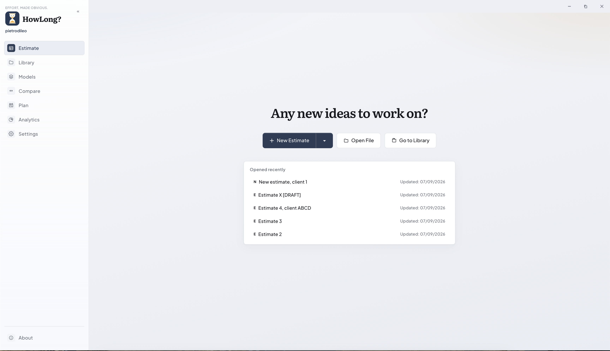

La schermata iniziale appare quando nessuna stima è attiva.

- La barra laterale apre Stima, Libreria, Modelli, Confronta, Pianifica, Analisi Dati, Impostazioni e About.
- **Nuova stima** usa il modello predefinito; la freccia apre la scelta del modello.
- **Apri file** carica una stima `.howlong.json` da un percorso accessibile.
- **Vai alla Libreria** apre in HowLong? la cartella locale configurata.
- **Aperti di recente** mostra fino a cinque stime salvate, dalla più recente. Passa il mouse su una riga per vedere che puoi aprirla.
- Il doppio chevron accanto al logo comprime la barra laterale. In modalità compatta passa il mouse su un'icona per leggerne il nome.

Pianifica e Analisi Dati usano sempre la scheda documento attiva. Senza una stima aperta chiedono di crearne o aprirne una.

| Termine | Significato |
| --- | --- |
| Modello | Struttura riusabile con default, categorie, etichette, formule e contingency |
| Stima | Documento di progetto creato da un modello o da zero |
| Macro | Attività principale che può contenere sotto-task |
| Sotto-task | Attività figlia il cui effort contribuisce alla macro |
| Formula | Riga calcolata a partire da altre voci |
| Contingency / CTG | Margine di rischio aggiunto alle attività abilitate |
| Sessione | Copia in memoria nella scheda; resta tale fino al salvataggio |
| Libreria | Cartella locale con le stime `.howlong.json` salvate |

## 3. Impostazioni

Apri **Impostazioni** prima della prima stima.

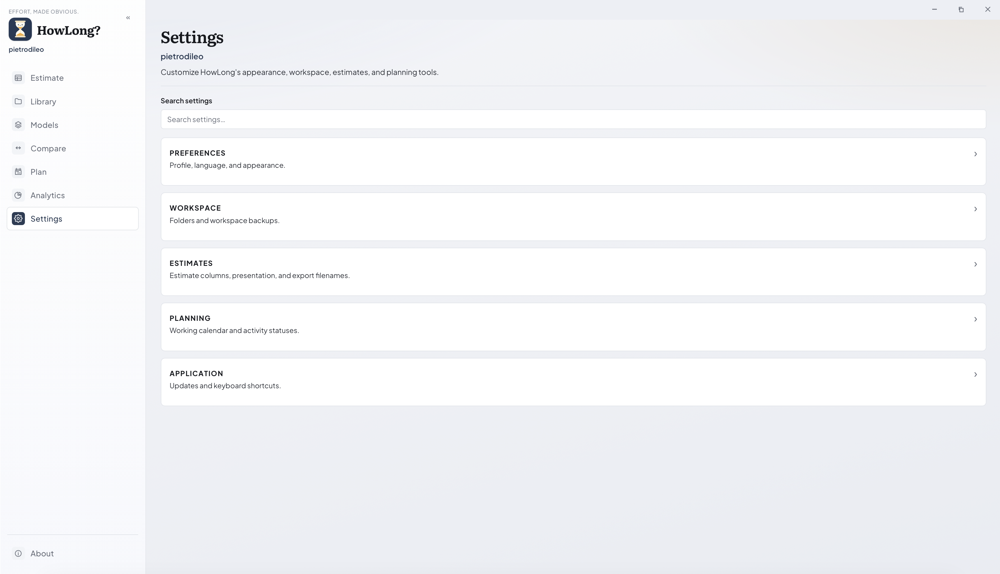

Ogni intestazione espande i propri controlli. Anche le sezioni chiuse contengono impostazioni.

- **Profilo:** imposta lo username registrato con i salvataggi; il default è quello del sistema operativo.
- **Lingua:** cambia l'interfaccia tra italiano e inglese, ma non traduce i nomi già memorizzati.
- **Aspetto:** seleziona il tema chiaro o scuro.
- **Scorciatoie:** mostra le combinazioni attive; consulta la [Sezione 13](#13-scorciatoie-da-tastiera).
- **Gantt:** definisce i weekend. Nasconderli modifica la timeline, non le date salvate.
- **Vista stima:** configura i default dell'editor, comprese le colonne inizialmente compatte.
- **Presentazione:** decide se note ed etichette partono nascoste nelle viste manager e cliente.
- **Nome file export:** controlla l'aggiunta opzionale di data e ora ai file generati.
- **Workspace:** mostra i percorsi di stime e modelli. **Scegli cartella…** usa una posizione personalizzata; **Usa default** ripristina i dati applicazione.
- **Import/export workspace:** trasferisce impostazioni e modelli. Le stime restano nella Libreria separata.

Puoi selezionare una cartella locale sincronizzata da OneDrive, Google Drive, Dropbox o un servizio simile. I colleghi possono condividere modelli e stime attraverso la cartella corrispondente. Tutti devono avere accesso alla cartella e installare il client desktop del servizio. Attendi il completamento della sincronizzazione prima di aprire le modifiche di un collega e non modificare la stessa stima nello stesso momento. HowLong? non offre co-authoring in tempo reale, blocco dei file o risoluzione automatica dei conflitti.

Seleziona **Salva** dopo le modifiche. Un'anteprima visibile di lingua o tema non garantisce da sola la persistenza.

## 4. Modelli

HowLong? include modelli standard in italiano e inglese. Apri **Modelli** per adattarli o creare strutture riusabili.

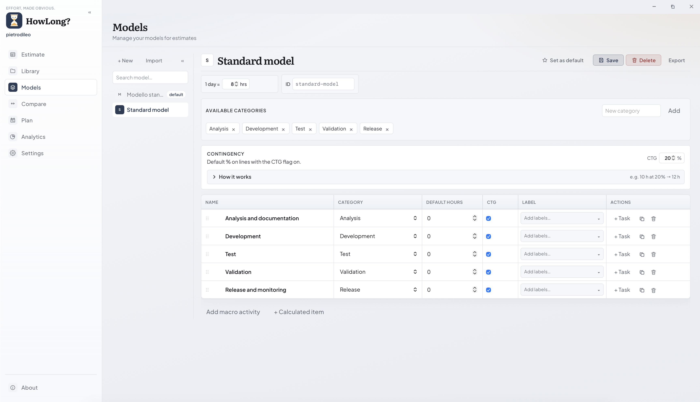

Il pannello sinistro elenca i modelli e indica quello predefinito. Il pannello destro modifica quello selezionato.

1. Seleziona **Nuovo** oppure importa un modello compatibile.
2. Imposta nome, icona, ID stabile e ore di una giornata lavorativa.
3. Aggiungi le categorie disponibili.
4. Imposta la CTG predefinita; espandi **Come funziona** per la spiegazione.
5. Aggiungi macro, sotto-task opzionali, effort predefinito, abilitazione CTG, etichette ed eventuali elementi calcolati.

Le maniglie riordinano le righe. Il chevron mostra i figli, **+ Task** aggiunge un sotto-task, duplica copia e il cestino elimina. **Salva** memorizza, **Elimina** rimuove ed **Esporta** crea una copia portabile.

Il modello predefinito controlla **Nuova stima** e la scorciatoia nuova scheda. Le stime esistenti sono copie indipendenti e non cambiano insieme al modello sorgente.

## 5. Editor della stima

Dalla Home seleziona **Nuova stima** per creare una nuova stima con il modello di default o scegli uno dei modelli dall'elenco.
Da un documento aperto usa il più nella barra delle schede per creare una nuova stima con il modello standard, oppure, anche in questo caso, puoi scegliere uno dei modelli.

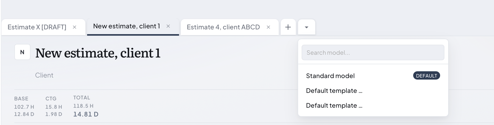

Il menu indica il modello predefinito.

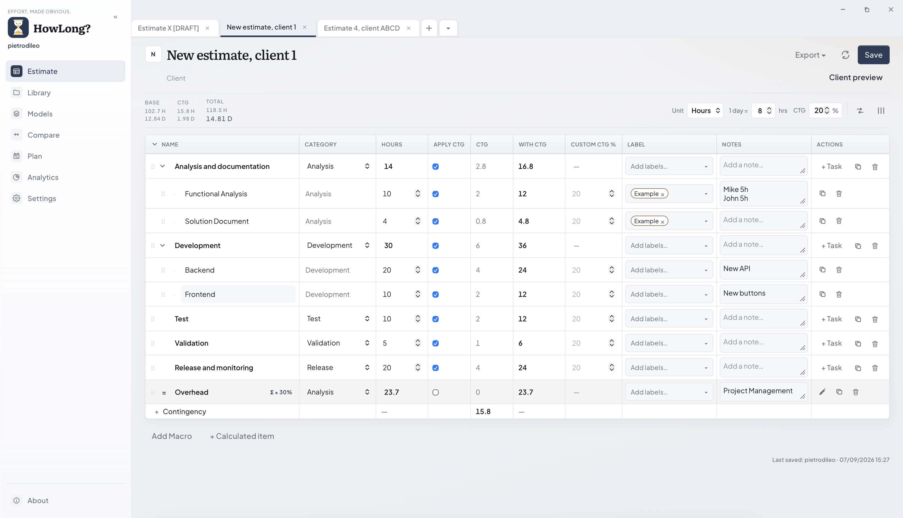

### Schede e stato

- Ogni scheda è una sessione indipendente, compresa la cronologia Annulla/Ripristina (CTRL+Z, CTRL+Y).
- La scheda attiva ha la sottolineatura scura. L'indicatore dirty segnala differenze dall'ultimo salvataggio.
- Chiudere lavoro non salvato richiede conferma.
- Aprire un file già presente attiva la scheda esistente senza duplicarla.

### Intestazione e totali

Modifica titolo, cliente e icona in alto. Base, CTG e Totale appaiono in ore e giorni. La barra controlla unità, ore per giorno, CTG globale, confronto contingency, colonne, export, ricaricamento, salvataggio e anteprima cliente.

Le ore per giorno sono una regola di conversione: cambiarle modifica i giorni-persona mostrati, non le ore memorizzate.

### Tabella attività

| Colonna | Significato |
| --- | --- |
| Nome | Nome e gerarchia di macro, sotto-task o formula |
| Categoria | Gruppo organizzativo e possibile target CTG |
| Ore / Giorni | Effort base prima della contingency |
| Applica CTG | Abilita la contingency sulla riga |
| CTG | Margine calcolato |
| Con CTG | Base più contingency |
| CTG custom % | Override della percentuale globale |
| Etichetta | Tag riusabili |
| Note | Dettagli interni, non automaticamente visibili al cliente |
| Azioni | Aggiunge figli, modifica formule, duplica o elimina |

Seleziona una cella per modificarla. Aggiungi macro o elementi calcolati sotto la tabella. I sotto-task si aggiungono dalla macro; quando esistono, il loro totale determina quello della macro. Applicare la CTG alla macro propaga l'impostazione ai figli. Le maniglie riordinano le righe supportate.

Fai doppio clic su una nota per l'editor esteso e premi `Ctrl+Invio` per salvarla. Fai doppio clic sull'intestazione di una colonna per comprimerla o ripristinarla.

### Elementi calcolati

Una formula calcola `aggregazione(voci selezionate) × percentuale`. Sono disponibili somma, media, minimo e massimo. Una formula riceve la CTG globale solo con **Applica CTG** attivo.

### Confronto contingency

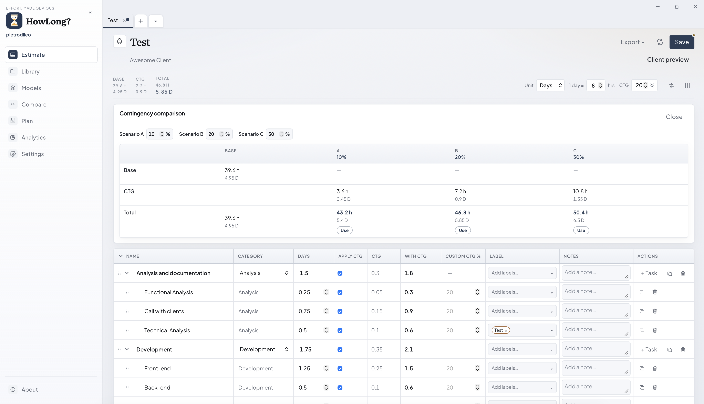

Il pannello mantiene fissa la base e confronta CTG e totali degli scenari A, B e C in ore e giorni. **Usa** applica una percentuale alla sessione; **Chiudi** nasconde il pannello. Salva per conservarla.

## 6. Salvare, aprire, ricaricare e usare i recenti

1. Seleziona **Salva** o `Ctrl/Cmd+S` per scrivere la stima attiva nella Libreria.
2. Usa **Apri file** per un `.howlong.json` esterno all'elenco visibile.
3. Usa ricarica per sostituire la copia in memoria con il file salvato; conferma se perderesti modifiche.
4. Usa **Aperti di recente** nella Home per le cinque stime salvate o aperte più recenti.

La riga dell'ultimo salvataggio registra username e data; il salvataggio aggiunge una voce di audit. La modalità browser mostra l'interfaccia, ma dialog e filesystem nativi richiedono l'app Tauri.

## 7. Libreria

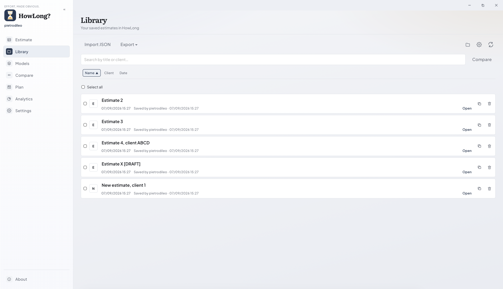

1. Cerca per titolo o cliente.
2. Ordina per nome, cliente o data.
3. Seleziona righe per confronto o export multiplo.
4. Seleziona **Apri** per creare o attivare una scheda.
5. Usa le azioni di riga per duplicare o eliminare.

**Importa JSON** copia una stima compatibile nella Libreria. Le icone cartella, impostazioni e aggiorna aprono il percorso, la configurazione e una nuova scansione. Una selezione esporta un file; più selezioni generano uno ZIP. Elimina rimuove il file sottostante.

## 8. Confrontare stime

Apri **Confronta** oppure seleziona almeno due righe in Libreria e scegli **Confronta**.

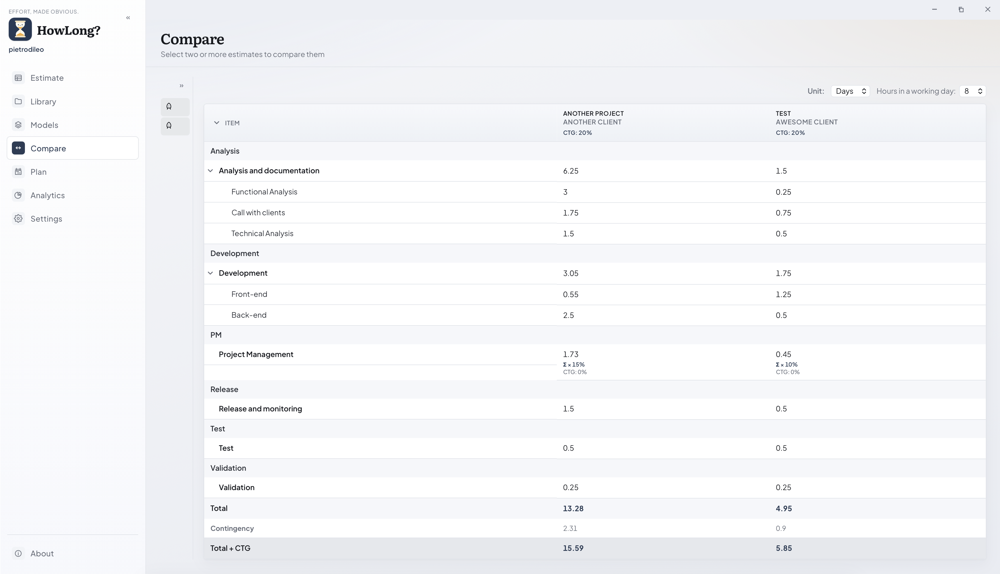

Usa il pannello sinistro per cercare, ordinare e selezionare le stime. La tabella a destra allinea le attività, con una colonna per ogni stima. Le categorie raggruppano il lavoro e i chevron espandono i figli. Sopra la tabella puoi scegliere ore o giorni e impostare la conversione ore/giornata. Le righe finali confrontano effort base totale e contingency.

Una cella vuota indica che la voce è assente; non significa zero se lo zero non è scritto. La vista è in sola lettura e non unisce i file.

## 9. Pianificare con il Gantt

Apri una stima e seleziona **Pianifica**.

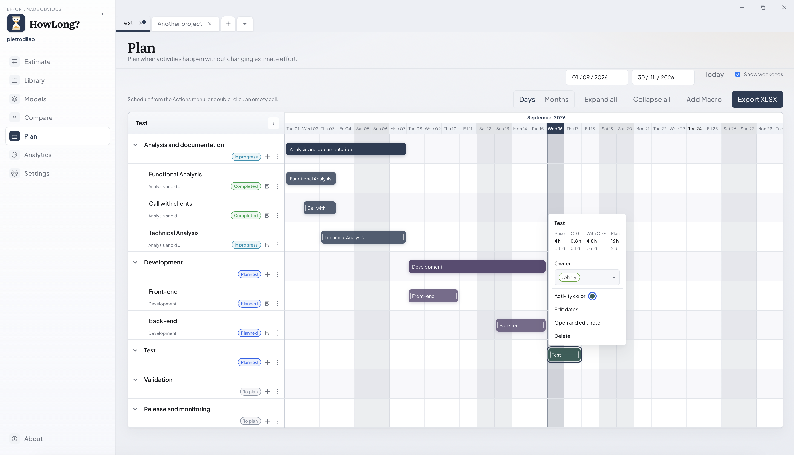

Il pannello sinistro contiene attività, date, colori e azioni. A destra c'è la timeline. La data scura è oggi e la fascia ombreggiata continua nelle celle. Le barre rappresentano intervalli di date, non quantità di effort.

1. Seleziona una data e scegli **Da pianificare**, oppure fai doppio clic su una cella vuota.
2. Modifica inizio/fine oppure trascina e ridimensiona la barra.
3. Limita l'intervallo con Da/A e usa **Oggi** per tornare alla data corrente.
4. Passa tra **Giorni** e **Mesi**; **Mostra weekend** segue le Impostazioni.
5. Usa **Espandi tutto**, **Comprimi tutto**, **Aggiungi Macro** o **Esporta XLSX**.

Seleziona il pallino colore della riga per cambiarlo. Comprimi una macro per nascondere i figli. La macro copre automaticamente dal primo inizio all'ultima fine dei sotto-task. Pianifica non cambia effort o CTG.

Trascina il divisore per ridimensionare il pannello attività o comprimilo per massimizzare la timeline:

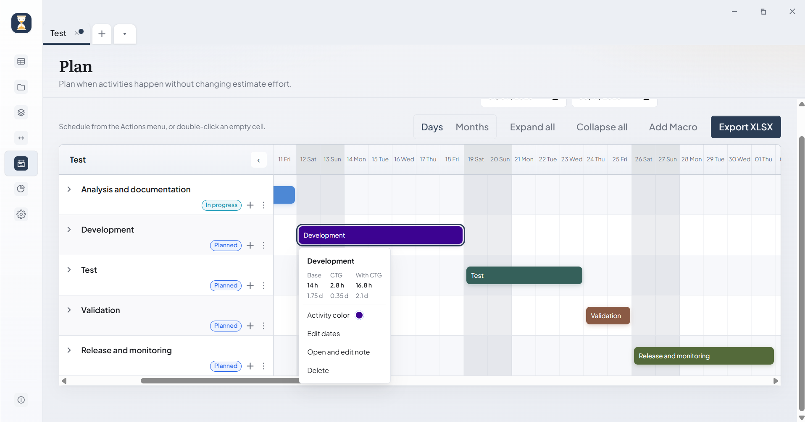

In modalità compatta, una prima colonna stretta mantiene visibili gli indicatori utili. Riapri il pannello con la freccia in alto a sinistra. L'export XLSX usa la scala, l'intervallo e i weekend visibili.

## 10. Analisi Dati

Apri una stima e seleziona **Analisi Dati** sotto Pianifica. La vista è in sola lettura.

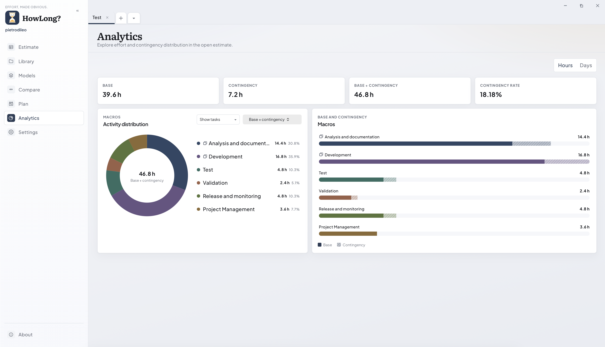

### Leggere la panoramica

- Le schede mostrano Base, Contingency, Base + contingency e Incidenza contingency.
- Il selettore Ore/Giorni cambia tutti i valori usando le ore per giorno della stima.
- L'anello mostra la distribuzione relativa; al centro riporta il totale selezionato.
- Le barre mostrano le stesse attività: colore pieno per la base e tratteggio per la contingency.
- Valori e percentuali appaiono nelle etichette; passa su un settore per la percentuale.

Il menu metrica offre Base, Contingency e Base + contingency; quest'ultimo è il default. L'icona task appare solo sulle macro con sotto-task e il tooltip segnala che sono esplorabili.

### Espandere macro selezionate nella panoramica

Apri **Mostra task** e seleziona le macro i cui figli devono sostituirle in entrambi i grafici.

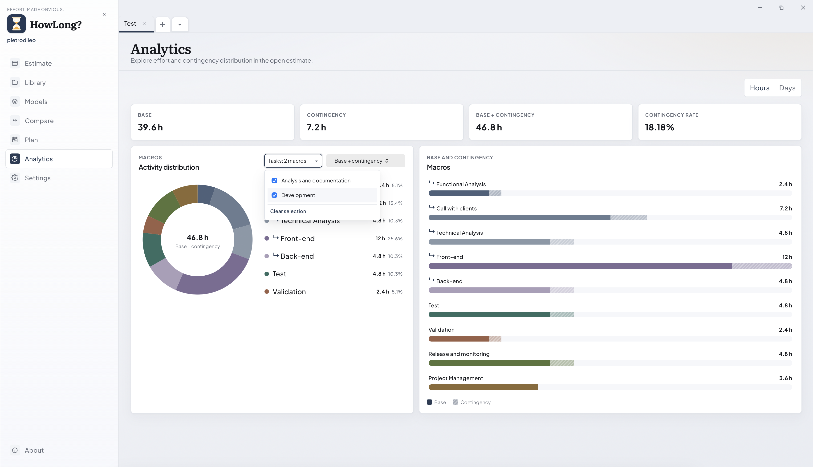

Il menu elenca solo macro con sotto-task e ne mostra sempre il nome. Puoi selezionarne più di una accanto alle macro non espanse. **Cancella selezione** ripristina la vista macro. I figli hanno una freccia e il tooltip indica la macro genitore.

### Focalizzare una macro

Seleziona una macro espandibile nell'anello, nella legenda o nelle barre per mostrare solo i suoi sotto-task in entrambi i grafici.

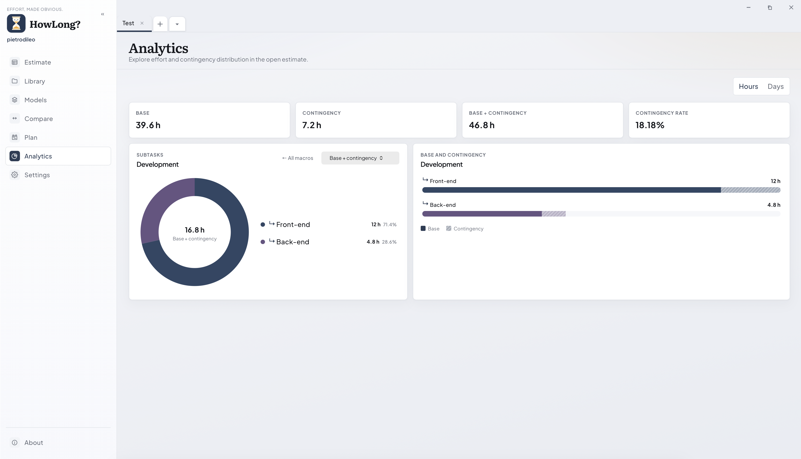

Le intestazioni identificano la macro e passano a Sotto-task. **Tutte le macro** torna indietro. Il focus isola una macro; Mostra task espande macro scelte nella distribuzione generale.

Lo stato è temporaneo, appartiene al documento attivo e si azzera cambiando documento. Con meno spazio i riquadri si impilano e i nomi lunghi vanno a capo o vengono abbreviati; passa il mouse sulle etichette interattive.

## 11. Presentazione manager e cliente

Seleziona **Anteprima cliente** nell'intestazione della stima. La pagina contiene due sezioni.

### Vista manager

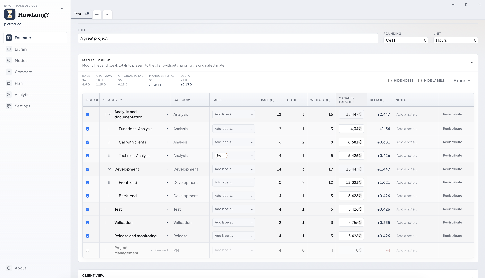

Imposta titolo cliente, arrotondamento e unità. Ogni riga mostra base e CTG calcolate, totale presentato modificabile e delta. Includi o escludi righe, modifica etichette e note e usa **Redistribuisci** per ripartire un totale macro tra i figli.

Gli override cambiano solo la presentazione, non il calcolo originale. Nascondi note o etichette quando serve e usa il menu Export della sezione.

### Vista cliente

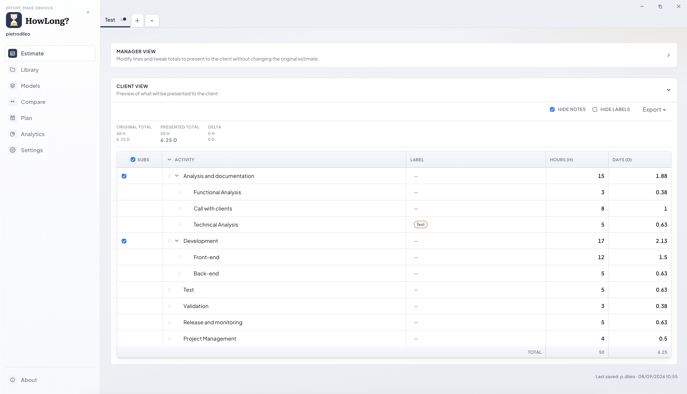

L'anteprima semplificata mostra le attività incluse e la gerarchia scelta. **Sotto-task** decide se mostrare i figli. Ore e giorni usano i valori presentati e le impostazioni di arrotondamento. Note ed etichette appaiono solo se abilitate. Controlla questa sezione prima della consegna.

Usa **Torna alla stima** per uscire. Le modifiche di presentazione restano nella sessione finché non salvi.

## 12. Import, export e backup

La [guida completa agli export](EXPORT_GUIDE.md) contiene esempi scaricabili e spiega le differenze tra gli output Stima, Manager, Cliente e Gantt.

### Scegliere la vista sorgente

| Sorgente | Cosa rappresenta | Uso migliore |
| --- | --- | --- |
| Stima | Calcolo completo dello stimatore con gerarchia, formule, contingency, note ed etichette | Handover tecnico e revisione dettagliata |
| Manager | Valori scelti, arrotondati, redistribuiti o presentati manualmente dal manager | Approvazione interna e preparazione proposta |
| Cliente | Solo attività scelte, gerarchia, valori presentati e note o etichette visibili | Consegna al cliente |
| Gantt | Date pianificate, gerarchia, colori, intervallo, scala e weekend visibili | Comunicazione della timeline |

| Formato | Uso |
| --- | --- |
| JSON HowLong | Stima nativa completa e modificabile; unico formato stima riapribile/importabile |
| YAML | Input strutturato per agenti AI e azioni revisionate, come preparare ticket Jira; non reimportabile |
| XLSX | Snapshot leggibile derivato da Stima, Manager, Cliente o Gantt |
| ZIP | Contenitore per più export dalla Libreria |

Dopo l'export seleziona **Apri** nel messaggio finale. L'app desktop apre il file salvato, mentre il browser apre la copia scaricata.

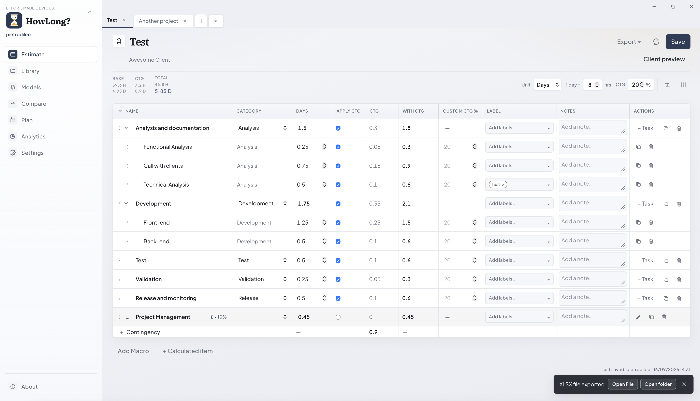

Esegui due backup: esporta il workspace per impostazioni e modelli e copia/esporta separatamente la Libreria per le stime.

**Salva** aggiorna il documento attivo nella Libreria. **Esporta → JSON** crea una copia `.howlong.json` completa e separata con input di calcolo, gerarchia, contingency, impostazioni di presentazione e pianificazione. Anche da una schermata di presentazione, il JSON resta un backup completo e non un file cliente filtrato.

Lo YAML Stima/Manager contiene dati dettagliati utili a un agente AI per proporre epic, ticket, sotto-task, piani, rischi o documentazione. Lo YAML Cliente è volutamente filtrato. Lo YAML non esegue azioni esterne: revisiona sempre il risultato prima che un agente scriva su Jira o altri sistemi.

## 13. Scorciatoie da tastiera

Su macOS usa `Cmd` dove è indicato `Ctrl/Cmd`.

| Scorciatoia | Azione | Nota |
| --- | --- | --- |
| `Ctrl/Cmd+S` | Salva la stima attiva | Funziona anche da Pianifica |
| `Ctrl/Cmd+T` | Nuova scheda dal modello predefinito | Non apre il menu modelli |
| `Ctrl/Cmd+W` | Chiude la scheda attiva | Chiede conferma se non salvata |
| `Ctrl/Cmd+E` | Passa tra stima e vista cliente | Solo nell'editor stima |
| `Ctrl/Cmd+Sinistra` | Scheda precedente | Non salva prima |
| `Ctrl/Cmd+Destra` | Scheda successiva | Non salva prima |
| `Ctrl/Cmd+Z` | Annulla | Solo scheda attiva |
| `Ctrl+Y` | Ripristina | Windows e Linux |
| `Cmd+Maiusc+Z` | Ripristina | macOS |
| `Ctrl+Invio` | Salva nota estesa | Con editor aperto |

Se una combinazione cambia, controlla la sezione Scorciatoie nelle Impostazioni per il valore aggiornato.

## 14. Cosa le schermate non mostrano o modificano

- Le immagini contengono nomi, valori, date, percorsi e username di esempio.
- I recenti della Home non sono l'intera Libreria.
- Le barre Gantt rappresentano date, non effort; Pianifica non ricalcola le ore.
- Analisi Dati visualizza ma non modifica la stima attiva.
- Gli override manager non sostituiscono i calcoli sorgente.
- La vista cliente omette dati in base a inclusione, sotto-task, note ed etichette.
- Il backup workspace non include la Libreria stime separata.
- La modalità browser non offre tutti i dialog e comportamenti filesystem nativi.

## 15. Risoluzione problemi e sicurezza

**Una stima salvata non appare:** controlla il percorso Workspace/Stime, poi aggiorna la Libreria. Verifica se il file è già aperto in un'altra scheda.

**La contingency è zero:** controlla Applica CTG, percentuale globale, modalità/categorie e percentuale custom. Una formula richiede il proprio Applica CTG.

**Il cliente non vede una voce:** controlla inclusione manager e i controlli Sotto-task, note ed etichette della vista cliente.

**Un import viene rifiutato:** usa un export JSON HowLong nativo. YAML e JSON generici non sono intercambiabili con `.howlong.json`.

**Le azioni file falliscono nel browser:** esegui `npm run tauri:dev`.

1. Salva prima di chiudere una scheda, ricaricare o cambiare cartella workspace.
2. Esporta JSON HowLong per una copia portabile.
3. Esegui separatamente il backup di workspace e Libreria.
4. Considera eliminazione, ricaricamento e import workspace come azioni potenzialmente distruttive.

Per installazione, sviluppo, test, build di release e versioning, usa il [README](../../README.md).
