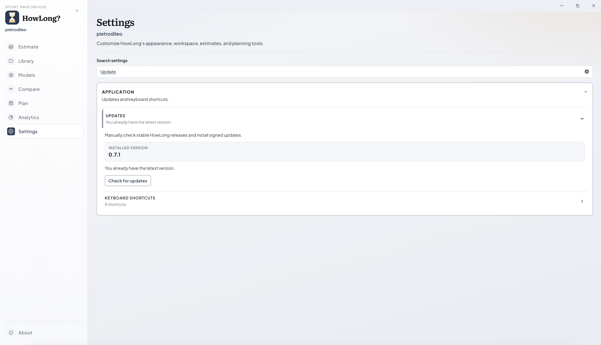
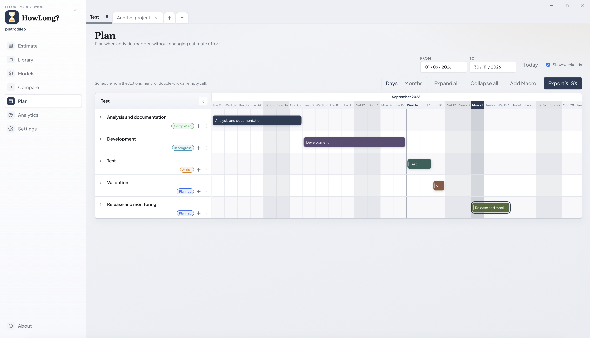

# Manuale utente di HowLong?

HowLong? `0.8.0` su Windows, macOS e Linux.

[README del progetto](../../README.md) · [Novità](../WHATS_NEW.md) · [Manuale inglese](GUIDE.en.md) · [Guida di build e rilascio](../BUILD.md)

**Prima sessione:** [Avvio rapido](#1-avvio-rapido) → [Impostazioni](#3-impostazioni) → crea una stima → **Salva**.

---

## Indice

- [Novità](../WHATS_NEW.md)
- [1. Avvio rapido](#1-avvio-rapido)
- [2. Area di lavoro e navigazione](#2-area-di-lavoro-home-e-navigazione-nella-barra-laterale)
  - [2.1. Barra laterale](#21-navigazione-nella-barra-laterale)
  - [2.2. Azioni Home](#22-vista-home-panoramica-dellarea-di-lavoro)
    - [2.2.1. Termini chiave](#termini-chiave-nella-tua-area-di-lavoro)
- [3. Impostazioni](#3-impostazioni)
  - [3.1. Aggiornamenti](#31-aggiornamenti)
  - [3.2. Cartelle sincronizzate](#32-cartelle-sincronizzate)
- [4. Modelli](#4-modelli)
- [5. Editor delle stime](#5-editor-delle-stime)
  - [5.1. La tua prima stima](#la-tua-prima-stima)
  - [5.2. Schede e stato](#schede-e-stato)
  - [5.3. Intestazione e totali](#intestazione-e-totali)
  - [5.4. Tabella delle attività](#tabella-delle-attività)
  - [5.5. Elementi calcolati](#elementi-calcolati)
  - [5.6. Confronto della contingenza](#confronto-della-contingenza)
- [6. Presentazione per manager e cliente](#6-presentazione-per-manager-e-cliente)
  - [6.1. Accesso alle modalità di presentazione](#accesso-alle-modalità-di-presentazione)
  - [6.2. Vista Manager](#vista-manager)
  - [6.3. Vista Cliente](#vista-cliente)
- [7. Salvataggio, apertura, ricaricamento e file recenti](#7-salvataggio-apertura-ricaricamento-e-file-recenti)
- [8. Libreria](#8-libreria)
- [9. Confrontare le stime](#9-confrontare-le-stime)
- [10. Pianificare con il Gantt](#10-pianificare-con-il-gantt)
- [11. Analisi](#11-analisi)
  - [11.1. Panoramica](#panoramica)
  - [11.2. Mostra attività (più macro)](#mostra-attività-in-più-macro)
  - [11.3. Focus (una macro)](#focus-singola-macro)
- [12. Importazione, esportazione e backup](#12-importazione-esportazione-e-backup)
  - [12.1. Scegliere la vista sorgente](#scegliere-la-vista-sorgente-per-lesportazione)
  - [12.2. Formati e limiti](#formati-e-limiti)
  - [12.3. Esportazione XLSX della stima](#esportazione-xlsx-della-stima)
  - [12.4. Esportazione XLSX del Gantt](#esportazione-xlsx-del-gantt)
  - [12.5. Checklist di esportazione e backup](#checklist-di-esportazione-e-backup)
- [13. Scorciatoie da tastiera](#13-scorciatoie-da-tastiera)
- [14. Cosa mostrano alcune schermate e cosa non fanno](#14-cosa-mostrano-alcune-schermate-e-cosa-non-fanno)
- [15. Risoluzione dei problemi e sicurezza](#15-risoluzione-dei-problemi-e-pratiche-sicure)

---

## 1. Avvio rapido

1. **Impostazioni:** imposta lingua, tema, nome utente e area di lavoro. Le impostazioni vengono salvate automaticamente.
2. **Stima:** fai clic su **Nuova stima**. HowLong? usa il modello predefinito, a meno che tu ne scelga un altro dal menu a freccia.
3. Inserisci un nome per la stima e il cliente, quindi compila le ore stimate per ciascuna attività.
4. Fai clic su **Salva**. Il file apparirà nella **Libreria**.
5. Controlla le sezioni **Piano**, **Analisi** e **Anteprima cliente** per verificare il lavoro.

| Azione            | Risultato                                                  |
| ----------------- | ---------------------------------------------------------- |
| **Salva**   | Aggiorna il file di lavoro `.howlong.json` nella Libreria |
| **Esporta** | Crea un file di consegna separato; non salva la stima      |

## 2. Area di lavoro, Home e navigazione nella barra laterale

Quando non è aperta alcuna stima, la **Home** mostra le azioni principali e una panoramica dell'area di lavoro.

---

### 2.1. Navigazione nella barra laterale

Usa la **barra laterale** per passare tra le aree principali dell'app. Ogni icona apre una parte del flusso di stima o della gestione dell'area di lavoro.

| Vista barra laterale   | Scopo                                                                                  |
| ---------------------- | -------------------------------------------------------------------------------------- |
| **Stima**        | Crea e modifica le stime di progetto, inserendo impegno e dettagli                     |
| **Libreria**     | Accede e gestisce i file di stima salvati                                              |
| **Modelli**      | Definisce e modifica modelli riutilizzabili con categorie, etichette e impostazioni    |
| **Confronta**    | Confronta visivamente le stime affiancate                                              |
| **Piano**        | Visualizza la timeline del progetto (diagramma di Gantt) usando i dati della stima     |
| **Analisi**      | Analizza suddivisioni, panoramiche e dettagli della stima attiva                       |
| **Impostazioni** | Personalizza lingua, aspetto, valori predefiniti, area di lavoro e informazioni utente |
| **Informazioni** | Legge dettagli sull'app, sulla versione e sui riconoscimenti                           |

- **Piano** e **Analisi** seguono sempre la scheda attualmente attiva. Se non è aperta alcuna stima, queste viste chiedono di crearne o caricarne una.
- Puoi comprimere la barra laterale con la doppia freccia accanto al logo. In modalità compatta, passa il mouse su un'icona per visualizzarne l'etichetta.

---

### 2.2. Vista Home (panoramica dell'area di lavoro)

Quando non è aperta alcuna stima, la **Home** ti aiuta a iniziare, riaprire un lavoro recente o esplorare l'area di lavoro.

**Azioni Home:**

- **Nuova stima** — usa il modello predefinito; usa la freccia per sceglierne uno diverso
- **Apri file** — carica qualsiasi `.howlong.json` dal sistema
- **Vai alla Libreria** — apre la cartella delle stime dell'area di lavoro
- **Aperti di recente** — fino a cinque delle stime salvate più recenti

---

#### Termini chiave nella tua area di lavoro

| Termine                     | Significato                                                                                 |
| --------------------------- | ------------------------------------------------------------------------------------------- |
| **Modello**           | Struttura riutilizzabile con valori predefiniti, categorie, etichette, formule e CTG         |
| **Stima**             | Documento di progetto basato su un modello o creato da zero                                  |
| **Macro**             | Attività di primo livello che può contenere sottoattività                                    |
| **Sottoattività**     | Attività dentro una macro; il suo impegno contribuisce al totale della macro                |
| **Formula**           | Riga calcolata in base ad attività selezionate                                               |
| **Contingenza / CTG** | Margine di rischio applicato al lavoro idoneo                                                |
| **Sessione**          | Copia in memoria aperta in una scheda finché non salvi                                       |
| **Libreria**          | Cartella locale contenente i file di stima `.howlong.json`                                   |

## 3. Impostazioni

Usa **Impostazioni** per scegliere lingua e tema, definire i valori predefiniti, selezionare un'area di lavoro e gestire gli aggiornamenti. Apri questa sezione prima della prima stima e torna qui quando cambia il tuo modo di lavorare.

Apri un gruppo per visualizzare i relativi pannelli. Usa il campo di ricerca per aprire automaticamente il gruppo e il pannello corrispondenti.

### 3.1. Aggiornamenti

Apri **Impostazioni → Aggiornamenti** per cercare manualmente una nuova release stabile. HowLong? non controlla gli aggiornamenti all'avvio né in background.

- **Controlla aggiornamenti** contatta il feed delle release ufficiali su GitHub e considera solo le release stabili.
- **Scarica aggiornamento** scarica l'artefatto per il sistema operativo e l'architettura correnti, ma non lo installa.
- **Installa e riavvia** applica l'aggiornamento firmato. Su macOS la prima installazione usa un `.dmg`; gli aggiornamenti interni all'app usano il bundle `.app.tar.gz` firmato. Windows e Linux usano i rispettivi artefatti firmati, installer o AppImage.
- L'aggiornamento passa direttamente all'ultima release stabile. Le versioni intermedie non vengono installate né eseguite, quindi ogni release deve mantenere o migrare i dati dell'area di lavoro esistente.
- Leggi le note di rilascio e salva/esporta il lavoro importante prima di un aggiornamento principale. L'anteprima nel browser non può installare aggiornamenti: usa l'app desktop.

I passaggi sono separati: il controllo non scarica e il download non installa. L'installazione diventa disponibile solo dopo il completamento del download firmato. Se il controllo o il download fallisce, l'installazione corrente resta invariata.

L'updater verifica la firma della release prima dell'installazione. La firma identifica il publisher ufficiale di HowLong? e non limita il codice open source. Un fork che pubblica le proprie build dovrebbe usare un proprio identificatore applicativo, endpoint delle release, chiave pubblica e secret di firma.

Ogni intestazione espande i relativi controlli e le sezioni chiuse conservano le impostazioni. Le modifiche vengono salvate automaticamente; la pagina mostra brevemente lo stato del salvataggio.

**Profilo e visualizzazione**

- **Profilo** — nome utente registrato al salvataggio (per impostazione predefinita, il nome utente del sistema operativo)
- **Lingua** — interfaccia in inglese o italiano
- **Aspetto** — tema chiaro o scuro
- **Scorciatoie da tastiera** — combinazioni attive; elenco completo nella [Sezione 13](#13-scorciatoie-da-tastiera)

Il tema scuro si applica alle schermate di stima, presentazione e pianificazione oltre che alle Impostazioni. Modifica solo la presentazione: i valori e le date salvati restano invariati.

| Tema scuro in una vista di presentazione | Tema scuro in Piano |
| --------------------------------------- | ------------------- |
|  |  |

**Valori predefiniti della stima**

- **Gantt** — giorni del fine settimana; nascondere i fine settimana influisce solo sulla visualizzazione, non sulle date salvate
- **Vista stima** — valori predefiniti dell'editor, incluse le colonne compatte
- **Assegnatari** — abilita più assegnatari per attività. Gli assegnatari condividono equamente la responsabilità; disattivando l'opzione, le assegnazioni multiple esistenti restano visibili e rimovibili, ma non è possibile aggiungerne altre.
- **Presentazione** — stabilisce se note ed etichette per manager/cliente iniziano nascoste
- **Nome file di esportazione** — data/ora opzionali nei nomi file generati

**Area di lavoro**

- **Area di lavoro** — percorsi di stime e modelli; **Scegli cartella…** o **Usa predefinita**. L'area predefinita è una cartella `HowLong` dentro la directory "Documents" del sistema. Ogni area di lavoro conserva le proprie stime, i propri modelli e i dati correlati. Cambiare cartella cambia i dati mostrati; tornando indietro ritrovi l'area di lavoro precedente.
- **Importazione/esportazione area di lavoro** — solo impostazioni e modelli (le stime restano nella Libreria)

### 3.2. Cartelle sincronizzate

Puoi collocare la cartella dell'Area di lavoro dentro una cartella sincronizzata da OneDrive, Google Drive, Dropbox o un servizio simile. In questo modo il team può condividere modelli e stime tramite la stessa cartella.

**Come funziona:**

- Chiunque debba accedere ai file deve avere installato il software di sincronizzazione e il permesso di usare la cartella condivisa.
- I colleghi vedranno le modifiche dopo che il loro client avrà scaricato i file `.howlong.json` aggiornati.

**Suggerimenti importanti per l'uso:**

- *Attendi la fine della sincronizzazione* prima di aprire un file modificato da qualcun altro.
- **Non aprire e modificare mai lo stesso file di stima contemporaneamente su computer diversi.** HowLong? non blocca né unisce i file. Due salvataggi sullo stesso file possono sovrascrivere le modifiche dell'altro.

**Esempi:**

- *Esempio 1:* Il team conserva i file `.howlong.json` in una cartella Google Drive condivisa. Prima di aprire un file, verifica che Drive abbia terminato la sincronizzazione.
- *Esempio 2:* Una collega modifica una stima in una cartella Dropbox. Attendi la fine della sincronizzazione prima di aprire quel file su un altro computer.

## 4. Modelli

Usa **Modelli** per creare punti di partenza riutilizzabili per le stime. Un modello può contenere attività standard, categorie, macro, sottoattività, contingenze e formule. È utile quando i tuoi progetti hanno una struttura simile.

Sono inclusi modelli in italiano e in inglese. Apri **Modelli** per modificare o creare strutture riutilizzabili.

Il pannello sinistro elenca i modelli e indica quello predefinito. Il pannello destro contiene l'editor.

1. Fai clic su **Nuovo** o importa un modello compatibile.
2. Specifica nome, icona, ID stabile e ore per giornata lavorativa del modello.
3. Aggiungi le categorie necessarie.
4. Imposta il CTG predefinito (espandi **Come funziona** per maggiori informazioni).
5. Aggiungi macro, sottoattività, valori di impegno predefiniti, flag CTG, etichette e formule.

Trascina gli elementi per riordinarli. Usa la freccia per mostrare i figli e fai clic su **+ Attività** per aggiungere una sottoattività. Ogni riga può essere duplicata o eliminata. Usa **Salva**, **Elimina** o **Esporta** per gestire il modello.

Il modello predefinito viene usato quando selezioni **Nuova stima** o premi `Ctrl/Cmd+T`. Le stime salvate sono istantanee: non si aggiornano se cambia il modello di origine.

## 5. Editor delle stime

L'**Editor delle stime** è il punto in cui costruisci la struttura del lavoro e calcoli l'impegno. Aggiungi macro e sottoattività, inserisci le ore, applica la contingenza e controlla i totali. Ogni stima si apre in una scheda con stato non salvato e cronologia separati.

### La tua prima stima

Per creare la tua prima stima:

- **Dalla Home:** fai clic su **Nuova stima** per iniziare con il modello predefinito, oppure seleziona un modello diverso dall'elenco.
- **Da un documento aperto:** usa il pulsante **+** nella barra delle schede per aprire una nuova stima (modello predefinito), oppure scegli un modello dall'elenco.

Ogni scheda ha il proprio stato non salvato e la propria cronologia.

### Schede e stato

| Segnale               | Significato                                      |
| --------------------- | ------------------------------------------------ |
| Sottolineatura scura  | Scheda attiva                                    |
| Punto di modifica     | Modifiche non salvate                            |
| Chiudi scheda         | Chiede conferma se ci sono modifiche non salvate |
| Riapri lo stesso file | Passa alla scheda esistente (nessun duplicato)   |

Ogni scheda ha il proprio annulla/ripristina: `Ctrl/Cmd+Z`; ripristina è `Ctrl+Y` (Windows/Linux) oppure `Cmd+Shift+Z` (macOS).

### Intestazione e totali

In alto puoi modificare **titolo**, **cliente** e **icona** della stima. I valori di impegno **Base**, **CTG** (contingenza) e **Totale** vengono visualizzati sia in ore sia in giorni.

La barra degli strumenti offre accesso rapido a unità, ore al giorno, contingenza globale (CTG), confronto contingenza, visibilità colonne, esportazione, ricaricamento, salvataggio e anteprima cliente.

La modifica delle **ore al giorno** cambia solo la visualizzazione dei giorni-persona. HowLong? memorizza sempre l'impegno in ore.

### Tabella delle attività

| Colonna              | Descrizione                                                                     |
| -------------------- | ------------------------------------------------------------------------------- |
| Nome                 | Titolo dell'attività: macro, sottoattività o formula mostrato nella gerarchia |
| Categoria            | Categoria/gruppo; può essere destinata alla contingenza (CTG)                  |
| Ore / Giorni         | Impegno di base stimato, prima della contingenza (CTG)                          |
| Applica CTG          | Indica se questa riga riceve una contingenza aggiuntiva                         |
| CTG                  | Importo di contingenza calcolato                                                |
| Con CTG              | Impegno totale con contingenza inclusa (base + CTG)                             |
| CTG personalizzato % | Override della percentuale di contingenza specifico della riga                  |
| Assegnatari          | Uno o più assegnatari con responsabilità equivalente, se abilitati nelle Impostazioni |
| Etichetta            | Tag personalizzati per filtrare o raggruppare                                   |
| Note                 | Note interne; non mostrate al cliente per impostazione predefinita              |
| Azioni               | Aggiunge sottoattività, modifica formula, duplica o elimina questa riga        |

**Modifica**

- Fai clic su una cella per modificarla
- Aggiungi macro o formule con i pulsanti sotto la tabella
- Le sottoattività vengono sommate nella macro; il CTG su una macro si applica ai suoi figli
- Trascina la maniglia per riordinare le righe

**Note e colonne**

- Doppio clic su una nota → editor esteso (`Ctrl+Enter` per salvare)
- Doppio clic sull'intestazione di una colonna → comprimi o espandi quella colonna

### Elementi calcolati

Gli **elementi calcolati** ricevono il proprio valore da altre attività tramite una formula. Usali quando un numero deve aggiornarsi da solo, ad esempio per sommare o calcolare la media di alcune righe. Si aggiornano quando cambiano le attività di riferimento.

Una formula è `aggregazione(righe selezionate) × percentuale`.

| Aggregazione | Opzioni                                                               |
| ------------ | --------------------------------------------------------------------- |
| Matematica   | Somma · media · min · max                                          |
| CTG          | Si applica solo quando **Applica CTG** è attivo per quella riga |

### Confronto della contingenza

Usa il confronto della contingenza per provare percentuali CTG diverse senza modificare l'impegno di base. Mostra tre scenari affiancati, così puoi scegliere il margine più adatto al progetto.

Confronta gli scenari **A**, **B** e **C** mentre **l'impegno di base resta fisso**.

1. Imposta le percentuali nel pannello.
2. Fai clic su **Usa** sotto uno scenario per applicarlo alla sessione corrente.
3. Fai clic su **Salva** per mantenere la scelta o su **Chiudi** per nascondere il pannello.

## 6. Presentazione per manager e cliente

HowLong? ha tre modalità di presentazione. **Stimatore** è la vista di lavoro, **Manager** prepara la stima per la condivisione e **Cliente** mostra le informazioni pubbliche selezionate.

| Funzionalità / Vista             | Vista Stimatore                                               | Vista Manager                                                          | Vista Cliente                                              |
| --------------------------------- | ------------------------------------------------------------- | ---------------------------------------------------------------------- | ---------------------------------------------------------- |
| **Pubblico**                | Stimatore interno (tu)                                        | Manager che preparano la condivisione con i clienti                    | Clienti finali                                             |
| **Accesso**                 | Schermata di modifica principale                              | Tramite Anteprima cliente > scheda Manager                             | Tramite Anteprima cliente > scheda Cliente                 |
| **Modificabile**            | Completo: aggiunta/modifica di attività, formule e struttura | Può regolare totali visualizzati, visibilità e note                  | Nessuna modifica: sola lettura, semplificata per chiarezza |
| **Colonne**                 | Tutte le colonne visibili e modificabili                      | Può personalizzare la visibilità delle colonne nell'esportazione     | Solo colonne/campi selezionati per chiarezza               |
| **Note ed etichette**       | Completamente modificabili                                    | Può mostrarle/nasconderle per l'esportazione                          | Visualizzate solo se consentite dal manager                |
| **Contingenza e CTG**       | Modificabili e visibili nel calcolo                           | Mostrati, possono essere presentati come totali arrotondati/rinominati | Mostrati come numeri arrotondati e adatti al cliente       |
| **Logica di presentazione** | I calcoli principali non sono influenzati dalle modifiche qui | Le modifiche di presentazione non influenzano la logica di base        | Segue le impostazioni del manager, non può sostituirle    |
| **Esportazione**            | Tipicamente per revisione interna                             | Crea un file pronto per il cliente con le rettifiche del manager       | Output finale destinato al cliente                         |
| **Confronta differenze**    | Non mostrato                                                  | Può visualizzare/modificare in anteprima le differenze nei totali     | Presentate solo come definito dal manager                  |

Usa queste modalità per preparare livelli diversi di dettaglio senza modificare i calcoli della stima.

### Accesso alle modalità di presentazione

Fai clic su **Anteprima cliente** nell'intestazione della stima. L'anteprima apre i layout Manager e Cliente affiancati.

---

### Vista Manager

Usa la vista Manager per preparare ciò che verrà mostrato al cliente. Serve a modificare la presentazione, non le regole di calcolo della stima.

Puoi modificare i totali mostrati, scegliere quali righe includere e gestire note ed etichette. La vista mostra anche la differenza tra i totali calcolati e quelli presentati.

| Controllo                              | Cosa fa                                                                                     |
| -------------------------------------- | ------------------------------------------------------------------------------------------- |
| Titolo cliente, arrotondamento, unità | Imposta come vengono etichettati e formattati i totali nell'esportazione                    |
| Totale presentato                      | Modifica il valore mostrato; visualizza la differenza rispetto alla base calcolata o al CTG |
| Includi / escludi                      | Sceglie quali righe compaiono nell'output per il cliente                                    |
| Etichette e note                       | Regola il contenuto che verrà passato a valle                                              |
| **Ridistribuisci**               | Ripartisce uniformemente un totale macro modificato tra le relative attività figlie        |

Tutte le regolazioni qui sono **solo per la presentazione**. Non alterano la logica di calcolo. Esporta da questa vista per creare il file destinato al cliente.

---

### Vista Cliente

La vista Cliente è la versione in sola lettura preparata per il cliente. Applica i filtri e le modifiche di presentazione del Manager.

Usa questa vista per controllare esattamente ciò che riceverà il cliente.

| Controllo                | Effetto                               |
| ------------------------ | ------------------------------------- |
| **Sottoattività** | Mostra o nasconde le attività figlie |
| Note / etichette         | Visibili solo quando abilitate        |
| Ore / giorni             | Valori presentati con arrotondamento  |

**Esporta** crea il file di consegna con attività incluse, modifiche del Manager e filtri di visibilità. Rivedi questa vista prima dell'invio.

**Torna alla stima** chiude l'anteprima. **Salva** memorizza le modifiche di presentazione nella stima.

## 7. Salvataggio, apertura, ricaricamento e file recenti

Questa sezione raccoglie le azioni principali sui file: salvare la stima attiva, aprire un altro file, ricaricare l'ultima versione salvata e riaprire i lavori recenti.

| Azione                             | Cosa fa                                                                                            |
| ---------------------------------- | -------------------------------------------------------------------------------------------------- |
| **Salva** / `Ctrl/Cmd+S`   | Scrive la stima attiva nella Libreria                                                              |
| **Apri file**                | Carica un `.howlong.json` dall'esterno della Libreria                                             |
| **Ricarica**                 | Sostituisce la scheda con l'ultimo file salvato (chiede conferma se ci sono modifiche non salvate) |
| **Aperti di recente** (Home) | Apre una delle cinque stime più recenti della Libreria                                            |

Ogni salvataggio registra nome utente, ora e una voce di audit. La riga di stato mostra l'ultimo salvataggio.

**Desktop vs browser:** usa `npm run tauri:dev` per l'app completa. `npm run dev` mostra solo l'interfaccia, senza finestre di dialogo native per i file né accesso al filesystem.

## 8. Libreria

La **Libreria** è l'elenco delle stime salvate nell'area di lavoro corrente. Da qui puoi cercare, ordinare, aprire, confrontare, importare, esportare, duplicare ed eliminare i file.

| Passaggio | Azione                                           |
| --------- | ------------------------------------------------ |
| 1         | Cerca per titolo o cliente                       |
| 2         | Ordina per nome, cliente o data                  |
| 3         | Seleziona righe → confronta o esporta in blocco |
| 4         | **Apri** → crea o attiva una scheda       |
| 5         | Menu riga → duplica o elimina                   |

**Importa JSON** copia una stima compatibile nella Libreria. Barra degli strumenti: apri cartella · impostazioni · aggiorna scansione. Una riga selezionata → un file; più righe → ZIP. Elimina rimuove il file dal disco.

## 9. Confrontare le stime

Confronta più stime affiancate. La vista è in sola lettura e non unisce mai i file.

> Il confronto usa la versione **salvata più di recente** di ciascuna stima. Le modifiche non salvate in una scheda aperta non compaiono.

**Apri:** barra laterale **Confronta**, oppure seleziona ≥2 righe nella Libreria → **Confronta**.

| Area              | Cosa puoi fare                                                 |
| ----------------- | -------------------------------------------------------------- |
| Pannello sinistro | Cerca, ordina e scegli le stime da confrontare                 |
| Tabella destra    | Ogni stima è una colonna; le righe si allineano per attività |
| Sopra la tabella  | Cambia unità (ore/giorni) e imposta la conversione            |
| Righe inferiori   | Visualizza base, contingenza (CTG) e totale con CTG              |

Le righe sono raggruppate per categoria e puoi espandere o comprimere le macro usando le frecce. Comprimi il selettore con la freccia in alto per dare più spazio alla tabella; le stime selezionate restano disponibili come icone. Le righe formula mostrano il riepilogo della formula e la percentuale CTG applicata in ogni colonna. Una cella vuota significa che l'attività non esiste in quella stima, non che abbia zero ore. Il confronto non modifica mai i file.

## 10. Pianificare con il Gantt

> Gli stati delle attività e i controlli per le note condivise sono stati aggiunti nella versione 0.6.1.

Usa il pianificatore Gantt per disporre le attività su un calendario. Imposta le date, ridimensiona le barre, aggiorna gli stati e controlla la timeline del progetto.

Piano modifica solo date e dettagli di pianificazione. Non cambia mai l'impegno né la contingenza (CTG).

Per iniziare: apri la stima, quindi fai clic su **Piano**.

| Pannello | Descrizione                               |
| -------- | ----------------------------------------- |
| Sinistro | Attività con date, colori categoria, stati, note e strumenti |
| Destro   | Timeline — la colonna evidenziata = oggi |

Le barre Gantt rappresentano **intervalli di date** per ciascuna attività; la lunghezza mostra la durata, non l'impegno.

**Come pianificare il lavoro:**

1. Seleziona una data e fai clic su **Da pianificare**, oppure fai doppio clic su una cella vuota.
2. Regola direttamente le date di inizio/fine nella riga, oppure trascina/ridimensiona la barra sulla timeline.
3. Usa **Da/A** per limitare le date visibili; **Oggi** passa alla colonna di oggi.
4. Passa tra **Giorni** e **Mesi**; **Mostra fine settimana** segue le Impostazioni dell'app.
5. Usa gli strumenti rapidi: **Espandi tutto**, **Comprimi tutto** ed **Esporta XLSX**. **Aggiungi macro** è disponibile sotto la timeline.

**Suggerimenti:**

- Il colore della categoria riempie il punto; l'anello esterno mostra lo stato dell'attività.
- Fai clic sullo stato di un'attività foglia per modificarlo, oppure usa l'icona nota per modificare la stessa nota mostrata nelle viste Stima.
- Gli stati delle macro sono calcolati dai sotto-task.
- Comprimere una macro nasconde le attività figlie.
- La barra di una macro si estende dall'inizio più precoce di un figlio alla fine più tardiva di un figlio.
- L'eliminazione di un assegnatario dal selettore richiede una conferma; confermando, l'assegnatario viene rimosso da tutte le attività della stima corrente.

Puoi ridimensionare il pannello attività usando il divisore. Comprimilo per ottenere una timeline più ampia, quindi usa la freccia in alto a sinistra per riaprirlo.

Usa **Salva** nell'intestazione di Piano per memorizzare modifiche a date, stato, note, assegnatario e colore. Un punto accanto al pulsante indica modifiche di pianificazione non salvate.

Durante l'esportazione in XLSX, HowLong? usa la scala della vista corrente, l'intervallo di date visibile e le impostazioni dei fine settimana. Dopo le colonne fisse dell'attività, il file mantiene la timeline con queste colonne: `Activity`, `Macro`, `Start`, `End`, `Base (days)`, `Base + CTG (days)`, `Planned (days)`, `Status`, `Notes` e `Owners`. `Planned (days)` conta l'intervallo pianificato secondo l'impostazione dei giorni lavorativi.

## 11. Analisi

Analisi mostra come l'impegno di base e la contingenza (CTG) sono distribuiti tra macro e attività. I grafici sono in sola lettura, quindi puoi esaminare la stima senza modificarla. Apri una stima e fai clic su **Analisi**.

### Panoramica

| Elemento            | Cosa mostra                                                                                |
| ------------------- | ------------------------------------------------------------------------------------------ |
| Schede di riepilogo | Totali: Base, Contingenza, Base + contingenza e tasso CTG                                  |
| Ore/Giorni          | Tutti i valori convertiti in base alle ore al giorno della stima                           |
| Grafico ad anello   | Quota per attività/macro; al centro viene visualizzata la somma della metrica selezionata |
| Barre               | Segue la metrica selezionata; in modalità combinata mostra base (pieno) e CTG (rigato) affiancati |

Il selettore condiviso controlla il grafico ad anello, le barre e la distribuzione per assegnatario. **Base + contingenza** è l'opzione predefinita e la prima nell'elenco, seguita da Base e Contingenza. Nelle modalità con una sola metrica le barre si ridimensionano su quella metrica; la modalità combinata mantiene base e CTG visivamente distinte. Le macro con sottoattività hanno un'icona attività e possono essere esplorate. Passa il mouse su segmenti o etichette per visualizzare le percentuali.

La distribuzione per assegnatario comprende il lavoro non assegnato e divide equamente un'attività con più assegnatari. Un grafico ad anello mostra la quota di ogni assegnatario, mentre le barre confrontano i carichi su una scala comune e separano impegno base e contingenza nella modalità combinata. Entrambi i grafici seguono il selettore condiviso, omettono gli assegnatari con valore zero e mantengono colori deterministici. Seleziona un segmento o una barra per mantenere visibili i grafici e aprire sotto di essi macro, sotto-task e voci derivate assegnate; i relativi indicatori di tipo condividono una colonna allineata e una colonna Effort separata mostra la quota di ogni riga per la metrica selezionata. Oltre otto assegnatari, l'elenco scorre all'interno del grafico.

La sezione **Analisi della pianificazione** mostra quanto effort operativo attivo possiede un intervallo pianificato, la distribuzione degli stati in ogni categoria, quante attività pianificate attraversano ciascuna settimana o mese e il numero di attività non stimate. La relativa scheda include macro, sotto-task e formule non annullate con effort base calcolato pari a zero. Le quote degli stati possono essere pesate con la metrica di effort selezionata oppure per numero di attività. Le attività annullate restano consultabili nei dettagli degli stati, ma non contribuiscono alle percentuali operative o alla timeline; formule e macro aggregate sono escluse in questi calcoli per evitare doppi conteggi. Seleziona una scheda di copertura, un segmento di stato o un periodo della timeline per vedere le attività che contribuiscono. L'analisi descrive la collocazione sul calendario e non deduce avanzamento, capacità, ritardi o qualità del piano.

### Mostra attività (in più macro)

Usa **Mostra attività** per selezionare macro ed espandere simultaneamente le relative sottoattività in entrambi i grafici.

Sono disponibili solo le macro con sottoattività e sono elencate per nome. Seleziona qualsiasi combinazione per mescolare nei grafici sottoattività espanse e macro invariate. Fai clic su **Cancella selezione** per tornare alla vista con sole macro. Le sottoattività compaiono con una freccia e un tooltip che indica la macro padre.

### Focus (singola macro)

Approfondisci i dettagli di una macro specifica facendo clic su di essa nel grafico ad anello, nella legenda o nel grafico a barre.

Entrambi i grafici mostreranno solo le sottoattività di quella macro. Fai clic su **Tutte le macro** per tornare alla panoramica completa.

| Modalità                  | Quando usarla                                                  |
| -------------------------- | -------------------------------------------------------------- |
| **Focus**            | Esamina in dettaglio le sottoattività di una macro            |
| **Mostra attività** | Espande e confronta più macro all'interno della distribuzione |

La modalità Analisi è temporanea e locale a ciascuna scheda; passando a un altro documento la vista viene reimpostata.

## 12. Importazione, esportazione e backup

Usa questa sezione per scegliere cosa esportare, condividere la vista adatta e conservare un backup recuperabile. Il formato JSON nativo è quello da usare quando devi riaprire o importare una stima.

I file di esempio sono disponibili nella cartella [`examples/`](../../examples/).

### Scegliere la vista sorgente per l'esportazione

La **vista sorgente** decide quali valori e campi compaiono nell'esportazione. Scegli quella che corrisponde alla persona che leggerà il file:

| Sorgente | Contenuti inclusi                                                                       | Ideale per                   |
| -------- | --------------------------------------------------------------------------------------- | ---------------------------- |
| Stima    | Calcolo completo, gerarchia completa, formule, CTG, note ed etichette                   | Passaggio tecnico            |
| Manager  | Numeri arrotondati, valori ridistribuiti/rettificati come mostrati ai manager           | Approvazione interna         |
| Cliente  | Solo attività incluse, gerarchia visibile, valori presentati, note/etichette pubbliche | Consegna al cliente          |
| Gantt    | Date, gerarchia, stato, assegnatario, note, colori, giorni base/CTG/pianificati e timeline | Comunicazione della timeline |

| Formato      | Scopo                                                                             |
| ------------ | --------------------------------------------------------------------------------- |
| HowLong JSON | Stima nativa completa; **unico formato che supporta la reimportazione**    |
| YAML         | Strutturato per l'IA (ad es. per la generazione di bozze Jira); non reimportabile |
| XLSX         | Vista istantanea facile da usare da qualsiasi sorgente sopra                      |
| ZIP          | Archivio contenente più esportazioni della Libreria                              |

Dopo l'esportazione, usa **Apri** nella finestra di completamento (su desktop, apre la posizione del file; nei browser, avvia il download).

**Backup:** salva sia l'area di lavoro (impostazioni e modelli) sia la Libreria (stime).

| Azione                    | Cosa fa                                                                             |
| ------------------------- | ----------------------------------------------------------------------------------- |
| **Salva**           | Aggiorna la stima attiva nella Libreria                                             |
| **Esporta → JSON** | Esporta un backup portabile `.howlong.json`, anche dalle schermate Manager/Cliente |

Le esportazioni YAML di Stima e Manager contengono abbastanza dettagli da permettere a strumenti IA di preparare epiche Jira, ticket o registri dei rischi. Rivedile prima di usarle in un flusso automatizzato. Lo YAML Cliente è filtrato per la condivisione pubblica. Le esportazioni YAML non attivano azioni da sole.

### Formati e limiti

| Formato                     | Scopo e limiti                                                                                                                                                                             |
| --------------------------- | ------------------------------------------------------------------------------------------------------------------------------------------------------------------------------------------ |
| **`.howlong.json`** | Formato nativo completo e validato; è l'unico formato che può essere riaperto o importato in HowLong. Conserva metadati, gerarchia, calcoli, regole CTG, presentazione e pianificazione. |
| **YAML**              | Formato strutturato per lettura, condivisione e automazione assistita dall'IA; non è un backup e non può essere importato in HowLong.                                                    |
| **XLSX**              | Istantanea leggibile da persone, generata dalla vista scelta; modificarla non aggiorna la stima e il file non può essere reimportato come documento nativo.                               |
| **ZIP**               | Contenitore per più esportazioni selezionate dalla Libreria; ogni file mantiene formato e scopo originali.                                                                                |

Il JSON esportato è una copia portabile distinta dalla sessione. Usalo per spostare una stima modificabile tra installazioni o creare un backup prima di modifiche rischiose. L'esportazione Cliente non è un backup completo perché può omettere attività nascoste e dettagli interni.

### Esportazione XLSX della stima

Un XLSX della vista Stima o Cliente presenta intestazione, cliente, unità, ore per giornata, percentuale CTG, gerarchia, ore, giorni, contingenza, totali presentati e note. La versione dettagliata mostra ogni sottoattività sotto la relativa macro:

Per ottenere rapidamente un foglio più compatto, usa i controlli di struttura di Excel sul margine sinistro: fai clic sul pulsante **2** per mantenere visibili macro e sottoattività, oppure sul pulsante **1** per comprimere il dettaglio e mostrare solo le macro. In alternativa, fai clic sul simbolo **−** accanto a una macro per comprimere solo quel gruppo; il simbolo diventa **+** e consente di riaprirlo.

La compressione nasconde le righe figlie nel foglio Excel e non elimina dati dalla stima né modifica i totali. È il modo più rapido per passare da una revisione dettagliata a un riepilogo per macro:

### Esportazione XLSX del Gantt

Usa **Esporta XLSX** dalla vista **Piano**. Il workbook contiene titolo, cliente, intervallo Da/A, scala, impostazione dei fine settimana, legenda dei colori e una riga per ogni macro o sottoattività. Ogni riga contiene:

| Colonna | Significato |
| ------- | ----------- |
| `Activity` / `Macro` | Nome dell'attività e macro padre |
| `Start` / `End` | Date pianificate; le date delle macro aggregano quelle dei figli |
| `Base (days)` | Impegno di base convertito usando le ore per giornata della stima |
| `Base + CTG (days)` | Impegno comprensivo di contingenza, convertito in giorni |
| `Planned (days)` | Numero di giorni nell'intervallo pianificato; i weekend seguono l'impostazione dei giorni lavorativi |
| `Status` / `Notes` / `Owners` | Stato operativo e metadati dell'attività |
| Colonne timeline | Celle giornaliere o mensili dell'intervallo esportato |

La precedente colonna Planning non è inclusa. L'esportazione è un'istantanea dell'intervallo Gantt corrente, non sostituisce l'esportazione nativa della stima e non modifica la stima.

Il file Gantt usa la scala e l'intervallo visibili al momento dell'esportazione. Non sostituisce l'esportazione della stima e non contiene il modello completo di calcolo.

### Checklist di esportazione e backup

1. Verifica la stima attiva e scegli **Stima**, **Manager**, **Cliente** o **Piano** in base al pubblico.
2. Per Manager e Cliente, controlla inclusioni, arrotondamenti, totali ridistribuiti, sottoattività, note ed etichette nella schermata.
3. Scegli JSON per il ripristino, YAML per flussi dati/IA e XLSX per revisione e consegna a persone.
4. Apri il file generato dal messaggio di completamento e controlla titolo, totali e attività visibili.
5. Conserva una copia `.howlong.json` quando il lavoro deve restare modificabile.

Per un backup completo, salva sia l'area di lavoro (impostazioni e modelli) sia la Libreria (stime). Una cartella sincronizzata con OneDrive, Google Drive, Dropbox o servizi simili sincronizza i file, ma non offre collaborazione simultanea: attendi la sincronizzazione e non modificare lo stesso `.howlong.json` su più computer contemporaneamente.

## 13. Scorciatoie da tastiera

Le scorciatoie coprono navigazione, modifica, schede e azioni frequenti. Sono personalizzabili, quindi l'elenco in **Impostazioni → Scorciatoie da tastiera** è la fonte di riferimento per la tua installazione.

macOS: sostituisci `Cmd` a `Ctrl/Cmd` nelle tabelle seguenti.

| Scorciatoia        | Azione                                      | Note                           |
| ------------------ | ------------------------------------------- | ------------------------------ |
| `Ctrl/Cmd+S`     | Salva la stima attiva                       | Funziona da Piano, ecc.        |
| `Ctrl/Cmd+T`     | Apre una nuova scheda (modello predefinito) | Salta il selettore modelli     |
| `Ctrl/Cmd+W`     | Chiude la scheda attiva                     | Chiede conferma se non salvata |
| `Ctrl/Cmd+E`     | Passa tra vista stima/cliente               | Solo editor                    |
| `Ctrl/Cmd+Left`  | Scheda precedente                           | Non salva                      |
| `Ctrl/Cmd+Right` | Scheda successiva                           | Non salva                      |
| `Ctrl/Cmd+Z`     | Annulla                                     | Solo scheda attiva             |
| `Ctrl+Y`         | Ripristina                                  | Windows, Linux                 |
| `Cmd+Shift+Z`    | Ripristina                                  | macOS                          |
| `Ctrl+Enter`     | Salva la nota estesa                        | Quando l'editor note è aperto |

Se una scorciatoia cambia, la fonte autorevole è sempre Impostazioni → Scorciatoie da tastiera.

## 14. Cosa mostrano alcune schermate e cosa non fanno

**Limiti:**

- Le schermate di esempio possono usare nomi, valori, date, percorsi o nomi utente segnaposto
- “Recenti in Home” è una vista rapida; la Libreria completa può includere più file
- La modalità di sviluppo nel browser può non disporre di finestre di dialogo native o dell'accesso completo al filesystem

**Cosa queste schermate *non* fanno:**

- Le barre Gantt mostrano date della timeline, non l'impegno; la schermata Piano non ricalcola le ore
- I grafici Analisi sono *in sola lettura*: visualizzano, ma non modificano, le stime
- Gli override a livello Manager non alterano la matematica sottostante
- La vista Cliente omette alcune inclusioni, sottoattività, note e impostazioni delle etichette in base alla visibilità
- Il backup dell'area di lavoro copre impostazioni e modelli, ma *non* l'intera Libreria delle stime

## 15. Risoluzione dei problemi e pratiche sicure

| Problema                                      | Soluzione                                                                                                                                                               |
| --------------------------------------------- | ----------------------------------------------------------------------------------------------------------------------------------------------------------------------- |
| Stima salvata mancante                        | Controlla il percorso Area di lavoro/Stime, aggiorna la Libreria e verifica le schede aperte                                                                         |
| CTG è zero                                   | Applica il CTG e imposta una percentuale globale o personalizzata; le formule richiedono anche **Applica CTG**                                                     |
| Il cliente non vede un elemento               | Controlla l'inclusione Manager e le impostazioni Cliente per **Sottoattività**, note ed etichette                                                                   |
| Importazione rifiutata                        | Importa solo JSON nativo di HowLong; YAML o JSON generico non è un file `.howlong.json`                                                                            |
| Le azioni sui file non funzionano nel browser | Esegui `npm run tauri:dev`                                                                                                                                            |

**Prima di qualsiasi azione rischiosa:**

1. Salva prima di chiudere, ricaricare o cambiare la cartella dell'area di lavoro.
2. Esporta un JSON HowLong per un backup portabile.
3. Esegui separatamente il backup dell'area di lavoro e della Libreria.
4. Considera eliminazione, ricaricamento e importazione di un'area di lavoro come azioni distruttive.

Per installazione, sviluppo, test, versioning e cronologia delle funzionalità delle release stabili, consulta la [guida di build e rilascio](../BUILD.md), le [novità](../WHATS_NEW.md) e il [README](../../README.md).
